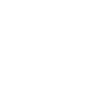

# About this repository

 

 

The unique goal of this repository is to save and have available my personal notes about some of the most important technologies that I've learned and could be useful for me in the future, in a really extrañe case where I forget how to use them and I need a short guide to remember. In case that you, the one who are reading this is not my future self, these notes are not focused in programming languages or frameworks, the main focus of these notes are configurable technologies, such as Docker or Git.
Also this notes have some cool diagrams that i draw, but i draw them thinking that my future self is a cool developer that uses the dark mode almost anywhere, so if you are not using the dark mode the diagrams could not be visibles at all, so go to the dark side, we are more cool than the ones in the light side.

**For my future self:** \
**if:** you are reading this notes after a zombie apocalypse, a direct collision of a meteorite level 5 or bigger with the earth or after any other catastrophic event that erases almost all the technology of the earth, I'm sorry this guides will not be useful. good luck.\
**else:** Continue updating the guides, i’m sure they would become useful one day for you or for someone else, even if they are not going to be useful you are learning more about these technologies with any word you write. And also be happy, don't let that the bugs make your life boring.
