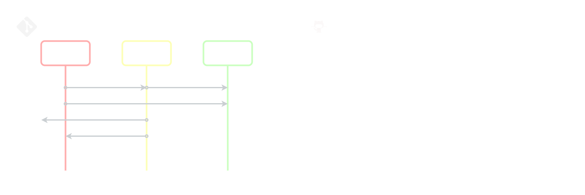
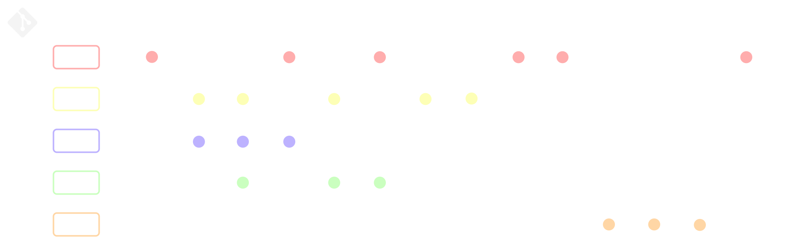
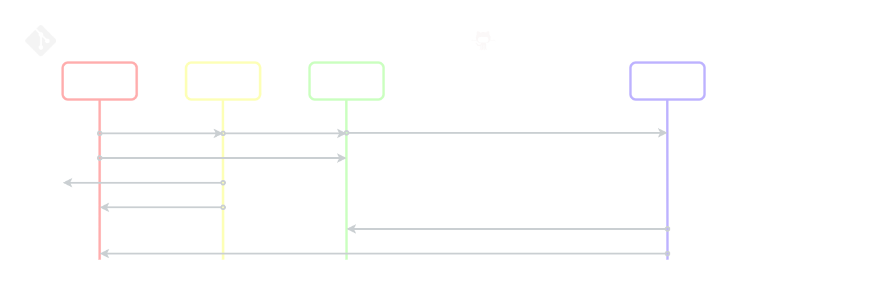
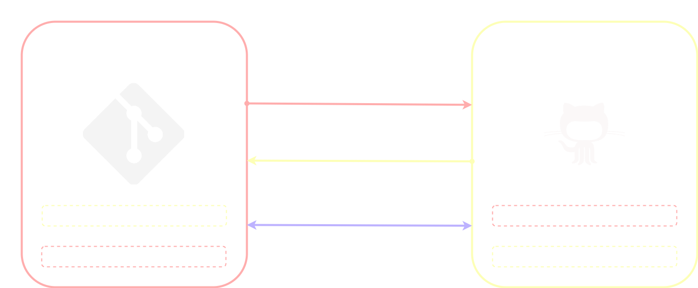
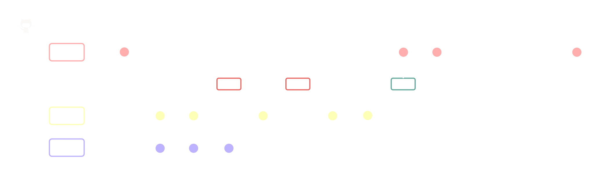
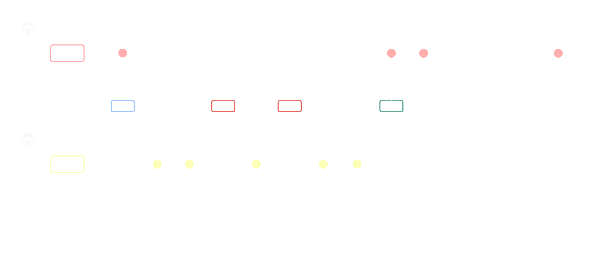

# Git y GitHub

[**Git**](https://git-scm.com/doc) es el sistema de versionamiento más popular actualmente, **Git** permite guardar el historial de cambios y el crecimiento de los archivos de un proyecto de forma atómica e incremental, por lo que cada cambio se escribe sobre el anterior y así sucesivamente desde la versión inicial hasta la final, lo que hace posible ver la evolución de los archivos con cada actualización sin almacenar cada versión completa, para esto **Git** emplea al interior de cada repositorio una base de datos que guarda los cambios de forma incremental, la cual se actualiza con cada versión nueva que llega al repositorio. [**GitHub**](https://docs.github.com/es) por su parte es el sistema de versionamiento remoto más popular actualmente, **GitHub** además permite trabajo colaborativo sobre los archivos de un repositorio remoto.\
**Git** y **GitHub** soportan versionamiento de archivos binarios, pero el versionamiento de archivos binarios no es tan preciso como con archivos basados en texto plano, por lo que normalmente se utilizan **Git** y **GitHub** solo para archivos de texto plano, como el código.

<br>

## Flujo de trabajo básico en Git

<p align="center">

</p>

Cuando se versionan archivos con repositorios **Git** locales los cambios pueden estar almacenados en tres posibles áreas, la primera es el **directorio de trabajo**, que simplemente es el directorio dentro de la máquina local en el que se inició el repositorio, la segunda área es el **área de staging**, que es un área de almacenamiento en la ram de la máquina local donde se preparan los cambios para ser agregados al repositorio y por ultimo esta el **repositorio**, que es un área de almacenamiento local o remota donde se guardan los archivos y se registran sus respectivos cambios a través de cada versión, dependiendo del nivel en el que esté un cambio este se puede considerar como **no rastreado** cuando solo está presente en el **directorio de trabajo**, **en espera** cuando está presente en el **directorio de trabajo** y el **área de staging** y **rastreado** cuando pasa a estar en **las tres áreas** luego de ser enviado del **área de staging** al **repositorio**, algunos de los conceptos más útiles al trabajar con **Git** de forma básica son:

- **commit:** Un commit es lo que sucede cuando un cambio pasa del área de staging al repositorio, es decir que pasa de estra **en espera** a estar **rastreado** por la base de datos de cambios del repositorio, al ser aceptado un cambio como una nueva versión con un commit, **Git** le asigna un número de versión o Id que identifica esa nueva versión, y además se registran otros metadatos como la fecha, hora y el usuario que hizo el commit, por lo que cada cambio en **Git** es rastreable por su Id y por los otros metadatos que son almacenados al hacer el commit.
- **Head:** Es la última versión rastreada por el repositorio mediante un **commit** en la rama actual.

<br>

### Mostrar comandos populares de git

```bash
git
```

Muestra algunos de los comandos más comunes usados en **Git** junto con una breve descripción de sus funciones.

<br>

### Mostrar ayuda de un comando

```bash
git [comando] --help
```

Muestra todos los parámetros que acepta un comando, además de una descripción muy detallada de la función del comando, si no se incluye un comando antes de **--help** es equivalente a **git**.

<br>

### Configuración de Git

```bash
git config [parámetros] [configuraciones]
```

Permite aplicar ciertas configuraciones a un repositorio, algunos de los parámetros más útiles al utilizar **git config** para configurar un repositorio son:

- **--global:** Indica a **Git** que esa configuración será aplicada a todos los repositorios de la máquina.
- **-l, --list:** Muestra la configuración actual del repositorio.

Algunos de los parámetros configurables más importantes de un repositorio son:

- **user.email=[correo del usuario]:** Cambia el correo electrónico del usuario.
- **user.name=[nombre del usuario]:** Cambia el nombre del usuario.

<br>

### Iniciar o finalizar un repositorio

```bash
git init [parámetros]
```

Inicia un repositorio **Git** en el directorio actual o lo elimina si el repositorio ya está creado, en caso de iniciarse el repositorio **Git** internamente crea el área de staging del repositorio y el repositorio, sin tocar el directorio de trabajo, el repositorio se crea dentro del directorio de trabajo en una carpeta oculta llamada **.git** y el área de staging se crea en la ram, si se utiliza **Git** init para finalizar el repositorio **Git** elimina el área de staging y el repositorio, sin tocar el directorio de trabajo.

<br>

### Agregar archivos al área de staging del repositorio

```bash
git add [parámetros] [ruta del archivo o directorio]
```

Inicia el rastreo de uno o varios archivos agregandolos al área de staging del repositorio. Lo más normal es usar **.** como ruta para rastrear y agregar todos los archivos de la carpeta actual al área de staging.

<br>

### Registrar cambios en el repositorio

```bash
git commit [parámetros]
```

Envía los últimos cambios desde el área de staging al repositorio para que este los registre en su base de datos de cambios, creando así una nueva versión basándose en los cambios realizados sobre uno o varios archivos, al crear una nueva versión a esta se le asigna un Id de versión y los cambios realizados en los archivo que son visibles para todos en el repositorio, por defecto los **commit** se realizan sobre la rama **master** si no se cambia la rama de trabajo actual, algunos de los parámetros más útiles al utilizar **git commit** para enviar los cambios del área de staging al repositorio son:

- **-m, --message "[mensaje]":** Permite agregar un mensaje al **commit**, idealmente todos los **commits** deben tener un mensaje que describa los cambios que se realizaron en la última versión subida al repositorio para facilitar la comprensión del versionamiento y los cambios hechos.
- **-a, --all:** Indica a **Git** que al hacer el **commit** pase al área de staging todos los cambios en los archivos que han sido previamente rastreados, es equivalente a realizar un **add** solo sobre los archivos que ya han sido registrados y luego un **commit** estándar, por lo que sí se han agregado nuevos archivos desde el último **commit** si es necesario utilizar **add** primero incluso usando este parámetro.

<br>

### Comprobar el estatus de la base de datos de cambios del repositorio

```bash
git status
```

Muestra el estatus de la base de datos de cambios del repositorio.

<br>

### Comparar cambios entre versiones del repositorio

```bash
git diff [parámetros] [Id del commit antiguo] [Id del commit nuevo]
```

Muestra los cambios entre una versión y otra del repositorio basadas en la misma rama, usando dos Id de los diferentes **commits**, si no se indican los **commits** con los que se quiere hacer el diff, usando su Id, por defecto el diff se realiza entre el directorio de trabajo y el área de staging.

<br>

### Mostrar los logs del repositorio

```bash
git log [parámetros]
```

Muestra todos los cambios históricos hechos en el repositorio al no incluir parámetros, log se centra en mostrar los Id de cada **commit**, pero también muestra la fecha, el autor y el comentario del **commit**, además de mostrar cual es el **commit** **Head** actualmente, algunos de los parámetros más útiles al usar **git log** son:

- **--stat:** Muestra los archivos en los que se hicieron cambios en cada log, además del número de Bytes que se cambiaron.
- **--all:** Muestra todos los cambios que han ocurrido.
- **--graph:** Muestra las ramas de las que ha salido cada commit.
- **--oneline:** Muestra una sola línea de texto de cada log.
- **--decorate:** Decora las líneas del grafo.

<br>

### Mostrar los cambios del repositorio

```bash
git show [parámetros]
```

Muestra todos los cambios históricos hechos en el repositorio al no incluir parámetros, show se centra en los cambios de las líneas realizados en los archivos, por lo que siempre muestra un diff entre el commit actual y el anterior de los archivos modificados en el último commit, ademas show muestra también toda la información que muestra log.

<br>

### Eliminar archivos del área de staging o del repositorio

```bash
git rm [parámetros] [nombre del archivo]
```

Elimina uno o varios archivos del área de staging o del repositorio, **git rm** necesita alguno de los siguientes parámetros para ejecutarse correctamente:

- **-f, --force:** Elimina los archivos del repositorio y del directorio de trabajo. el repositorio guarda el registro de la existencia de los archivos, por lo que pueden ser recuperados de ser necesario.
- **--cached:** Elimina uno o varios archivos del área de staging, por lo que para pasarlos al repositorio hará falta volver a enviarlos al área de staging antes con un **commit**.

Algunos de los parámetros opcionales más útiles al utilizar **git rm** para eliminar archivos del área de staging o del repositorio son:

- **-r:** Habilita la remoción recursiva cuando le es dado el nombre de un directorio.

<br><br>

## Administración de ramas y versiones en Git

<p align="center">

</p>

Las ramas permiten dividir el código fuente de una aplicación en diferentes líneas separadas cronológicamente que luego se unen para formar una solo código fuente, por defecto **Git** trabaja sobre la rama **master** pero normalmente cuando se trabaja en un equipo de desarrollo se utilizan diferentes ramas para que varios miembros del equipo trabajen en simultáneo en partes o funcionalidades distintas de una misma aplicación. Cuando se crea una rama nueva basicamente lo que se hace es crear una copia de la última versión de la rama master de una nueva rama separada, y los cambios que se realicen en esta nueva rama no serán visibles en master hasta que no se fusionan las dos ramas con una operación llamada **merge**.
\. algunos de los conceptos más útiles al trabajar con ramas de **Git** son:

- **merge:** Un merge es una operación que se realiza cuando se une el código de dos ramas diferentes para generar una nueva versión.
- **conflicto:** Un conflicto es lo que sucede cuando al realizar un merge los cambios de una rama dañan el funcionamiento de la otra rama, por lo que la nueva versión no funciona correctamente, o simplemente los cambios son incompatibles, por lo que no se puede realizar el merge correctamente.

<br>

### Administrar ramas

El comando **git branch** se emplea para realizar las principales acciones que realiza git en relación con ramas, como crear, listar y eliminar ramas, además de otras adicionales, como crear copias de ramas o renombrar ramas.

#### Crear ramas

```bash
git branch [parámetros] [nombre de la rama]
```

La acción por defecto de **git branch** si no se dan parámetros y se da un nombre es crear una nueva rama con el nombre indicado, la nueva rama se crea en base a la rama en la que se está posicionado actualmente, por lo que al crear una nueva rama es recomendable estar posicionado en la rama más actualizada.

#### Listar ramas

```bash
git branch [parámetros]
```

La acción por defecto de **git branch** si no se dan parámetros y no se da un nombre es listar las ramas disponibles resaltando la rama actual, algunos de los parámetros más útiles para listar ramas usando **git branch** son:

- **-l, --list [patron]:** Es equivalente a usar **git branch** sin parámetros, pero adicionalmente se puede proporcionar un patrón para listar solo las ramas cuyo nombre coincide con el patrón dado.
- **-r, --remotes:** Modifica la función del comando para listar las ramas remotas, al combinarlo con **--list** se puede proporcionar un patrón para listar solo las ramas cuyo nombre coincide con el patrón dado.
- **-a, --all:** Modifica la función del comando para listar ramas locales y remotas, al combinarlo con **--list** se puede proporcionar un patrón para listar solo las ramas cuyo nombre coincide con el patrón dado.

Para ver las ramas también se puede usar el siguiente comando, el cual muestra de forma "gráfica" la evolución del proyecto basándose en ramas, ids de commit y mensajes de commit.

```bash
git log --all --graph --decorate --oneline
```

Otro comando alternativo para ver la historia de las ramas es **git show-branch**, este comando además de mostrar las ramas muestra también el historial de los commits del repositorio distinguiendo las ramas.

```bash
git show-branch [parámetros]
```

- **-a, --all:** Modifica la función del comando para listar todo el historial de commits y ramas disponibles.

#### Eliminar ramas

```bash
git branch --delete [parámetros adicionales]
```

Para eliminar una rama se debe usar el comando **git branch** junto al parámetro **-d** o **--delete**, usando este parámetro en cualquiera de sus dos formas se modifica la función del comando para eliminar ramas, sin embargo, para eliminar una rama sin errores usando este parámetro la rama primero se debe haber sincronizado con el repositorio remoto en caso de tener uno, algunos de los parámetros adicionales más útiles para eliminar ramas usando **git branch** en combinación con el parámetro **-d** o **--delete** son:

- **-f, --force:** Al usare con **--delete** permite borrar una rama independientemente de su estatus.
- **-D:** Atajo para la combinación de **--delete --force**.

#### Parámetros adicionales

Algunos de los parámetros adicionales que también acepta **git branch** para tener funciones adicionales son:

- **-m, --move [nuevo nombre]:** Renombra la rama actual.
- **-c, --copy [nombre de copia de la rama]:** Crear una copia de la rama actual.
- **-f, --force:** Restablece el estado de la rama actual a su estado inicial, incluso si el nombre inicial de la rama fue asignado a otra rama que aún existe, al combinarse con **--move** permite renombrar la rama actual incluso si el nombre nuevo ya existe y al combinarse con **--copy** permite crear una copia de la rama actual incluso si el nombre de la copia ya existe.
- **-M:** Atajo para la combinación de **--move --force**.
- **-C:** Atajo para la combinación de **--copy --force**.

<br>

### Fusionar ramas

```bash
git merge [parámetros] [nombre de la rama]
```

Fusiona los archivos de la rama indicada con la rama actual, algunos de los parámetros más útiles al usar **git merge** son:

- **-m [mensaje]:** Un merge por defecto genera una nueva versión y un commit, por lo que es necesario que haya un mensaje que indique los cambios que se hicieron en el último commit.

Al fusionar dos o más ramas con **merge** pueden presentarse conflictos cuando en las ramas se alteran las mismas líneas de diferentes formas, para solventar estos conflictos se deben borrar todas las líneas que no correspondan con los cambios que se desean conservar en la rama, la forma en la que **Git** representa un conflicto en un archivo es usando **<<<<<<< HEAD** para indicar donde inicia el código de la rama actual, **>>>>>>> new_branch_to_merge_later** para indicar donde finaliza el código de la rama que se quiere fusionar con la rama actual (en este caso **new_branch_to_merge_later**) y **=======** para indicar el final del código de la rama actual y el inicio del de la rama que se quiere fusionar, un ejemplo de cómo se representa un conflicto en **Git** sería el siguiente:

```python
<<<<<<< HEAD
print("HolaMundo")
=======
print("HelloWorld")
>>>>>>> new_branch_to_merge_later
```

En este caso suponiendo que se quiera conservar el mensaje que diga **HolaMundo** en la rama actual se eliminará el resto del código, dejando como resultado:

```python
print("HolaMundo")
```

En caso contrario el resultado sería:

```python
print("HelloWorld")
```

Algunos editores tienen herramientas para resolución de conflictos integradas, pero simplemente consisten en lo mismo, borrar las partes que no se quieren conservar dejando en el archivo solo las que se quieren conservar.

<br>

### Moverse entre ramas y versiones

El comando **git checkout** actualiza los archivos del directorio de trabajo para que correspondan con los de una rama o una versión específica del repositorio.

#### Moverse entre versiones

```bash
git checkout [parámetros] [Id del commit|HEAD] [nombre del archivo]
```

Traer versiones especificadas de un archivo al directorio de trabajo, si no se indica un archivo al final del comando se traerán todos los archivos de la versión indicada al directorio de trabajo, para conservar los cambios luego de traer uno o varios archivos al directorio de trabajo basta con hacer un **add** y un **commit**, si no se quieren conservar los cambios hechos por el checkout basta con hacer un nuevo checkout apuntando a la última versión o **HEAD** para descartarlos.

#### Moverse entre ramas

```bash
git checkout [parámetros] [nombre de la rama]
```

Traer los archivos de una rama al directorio de trabajo y cambiar la rama actual.

<br>

### Administrar tags

Los tag son una manera de etiquetar estados de un repositorio, se usan comúnmente para indicar las versiones o releases de un proyecto mantenido con **Git**, sin embargo, el versionamiento no afecta internamente al proyecto, solo establece etiquetas asociadas a los releases, usualmente el etiquetado de versiones usando tags se hace siguiendo el [**versionamiento semántico**](https://semver.org/lang/es/), que es uno de los más populares y sencillos de usar, la mayor parte de las acciones que se realizan en Git con relación a los tags se realizan usando el comando **git tag**.

#### Crear tags

```bash
git tag -a [nombre del tag] -m [mensaje] [id del commit]
```

El comando base para administrar tags en **Git** es **git tag**, incluyendo los parámetros **-a** y **-m** se crea un nuevo tag agregando un nombre de tag y un mensaje de tag, adicionalmente para crear un nuevo tag en **Git** hay que indicar a qué commit estará asociado el nuevo tag, el nuevo tag será creado, pero solo será registrado de forma local, para enviar el nuevo tag a **GitHub** hace falta usar una variación del comando **git push** ya que los tags no son considerados como cambios, por lo que el comando regular no envía los tags a **GitHub**.

```bash
git push [nombre del repositorio remoto] --tags
```

Al crear un nuevo tag es útil usar antes el siguiente comando para ver de forma "gráfica" la evolución del proyecto basándose en ramas, ids de commit y mensajes.

```bash
git log --all --graph --decorate --oneline
```

#### Listar tags

```bash
git tag
```

Al usar el comando **git tag** sin incluir parámetros adicionales se listan todos los tags del repositorio.

```bash
git show-ref --tags
```

El comando **git show-ref** seguido por el parámetro **--tags** tiene un comportamiento similar a **git tag** con la ventaja de que además lista el id del commit que corresponde con cada tag.

#### Eliminar tags

```bash
git tag -d [nombre del tag]
```

Al usar el comando **git tag** con el parámetro **-d** se elimina el tag correspondiente con el nombre de tag indicado, sin embargo esto solo ocurre en el repositorio local, para eliminar un tag en **GitHub** hace falta usar una variación del comando **git push** indicando además de los parámetros usuales el nombre del tag que se va a eliminar, esto se debe a que **GitHub** trata de conservar los tags, ya que usualmente están asociados a releases, por lo que no es normal ni adecuado eliminar un tag de **GitHub**.

```bash
git push [nombre del repositorio remoto] :refs/tags/[nombre del tag]
```

<br>

### Regresar a versiones anteriores del repositorio

```bash
git reset [modo] [Id del commit]
```

Mueve el **Head** del **commit** actual al **commit** indicado, dependiendo del modo al cambiar el **Head** todo los cambios luego de ese **commit** son descartados o se envían al área de staging para poder rastrearlos en el repositorio después, entre otras opciones que cambian según el modo, algunos de los modos más usados son:

- **--soft:** Elimina los cambios en el repositorio, mantiene los cambios del área de staging y mantiene los cambios en el directorio de trabajo, por lo que los cambios hechos luego del **commit** indicado en el área de staging y en el directorio de trabajo pueden agregarse al repositorio posteriormente con un **add** y un **commit**.
- **--mixed:** Es el modo por defecto, Elimina los cambios en el repositorio, elimina los cambios del área de staging, pero mantiene los cambios en el directorio de trabajo, por lo que los cambios hechos luego del **commit** indicado en el directorio de trabajo pueden agregarse al repositorio posteriormente con un **add** y un **commit**.
- **--hard:** Elimina los cambios en el repositorio, elimina los cambios del área de staging y elimina los cambios del directorio de trabajo, por lo que ninguno de los cambios hechos luego del **commit** podrán agregarse posteriormente al repositorio.

<br><br>

## Administración de repositorios remotos con Git y GitHub

<p align="center">

</p>

Un repositorio remoto es lo que se utiliza en la mayoría de casos en los que un desarrollo es el producto del trabajo de varios desarrolladores que trabajan en equipo para construir una sola aplicación, por lo tanto, al utilizar un repositorio remoto como **GitHub** o **GitLab** lo que se hace es agregar una cuarta área adicional a las tres que se usan al trabajar con un repositorio **Git** local, que es la del servidor remoto al que se envían con un **push** los cambios luego de ser **rastreados** por el repositorio local con un **commit** para que todas las personas del equipo puedan ver y trabajar sobre los cambios más recientes realizados en el repositorio remoto.\
Las guías para crear repositorios remotos con [**GitHub**](https://guides.github.com/) y [**GitLab**](https://docs.gitlab.com/) estan enlazadas a sus nombres en este comentario.

<br>

### Administrar repositorios remotos

```bash
git remote [sub comandos] --verbose
```

Permite realizar varias acciones en los diferentes repositorios remotos vinculados basados en **Git** según el sub comando indicado, si no se da algún subcomando muestra un listado de los repositorios remotos vinculados, se puede incluir un único parámetro al utilizar **git remote** sin sub comandos:

- **-v, --verbose:** Hace que se muestran las urls además de los nombres asignados a los repositorios remotos al listarlos.

#### Agregar repositorio remoto al repositorio local

```bash
git remote add [nombre del repositorio remoto] [url del repositorio remoto]
```

Vincula al repositorio local un repositorio remoto, el cual se puede llamar posteriormente con el nombre dado, normalmente **origin**, para realizar acciones como **push**, **pull** o **fetch**.

<br>

### Cambiar la url de un repositorio remoto

```bash
git remote set-url [nombre del repositorio remoto] [url del repositorio remoto]
```

Cambia la url del repositorio remoto, es especialmente útil cuando se quiere cambiar la conexión de un repositorio de protocolo HTTPS a SSH.

<br>

### Clonar un repositorio remoto

```bash
git clone [parámetros] [url del repositorio remoto]
```

Crea una copia de todos los archivos del repositorio remoto en el repositorio local y en el directorio de trabajo, sin cambiar nada en el área de staging, además vincula la copia local con la remota, por lo que si se tiene los permisos se pueden hacer acciones como **push**, **pull** o **fetch** sin realizar configuraciones adicionales, algunos de los parámetros más útiles al clonar un repositorio con **git clone** son:

- **-o [nombre del repositorio remoto], --origin [nombre del repositorio remoto]:** Cambia el nombre de referencia del repositorio remoto para no usar **origin** como nombre de referencia.

<br>

### Traer los cambios del repositorio remoto al repositorio local

```bash
git fetch [parámetros] [nombre del repositorio remoto] [rama del repositorio local]
```

Actualiza una rama del repositorio local con los últimos cambios de la misma rama del repositorio remoto, sin alterar el área de staging ni el directorio de trabajo, por lo que si se quieren traer los cambios no solo al repositorio local si no también al directorio de trabajo hace falta realizar también un **merge**.

<br>

### Traer los cambios repositorio remoto al repositorio local y al directorio de trabajo

```bash
git pull [parámetros] [nombre del repositorio remoto] [nombre de la rama]
```

Actualiza una rama del repositorio local con los últimos cambios de la misma rama del repositorio remoto, y tambien trae los cambios al directorio de trabajo sin alterar el área de staging, es equivalente a hacer un **fetch** en simultáneo con un **merge** entre el directorio local y el repositorio local, el cual ya fue actualizado con los últimos cambios en el repositorio remoto mediante **fetch**.

<br>

### Subir cambios del repositorio local al repositorio remoto

```bash
git push [parámetros] [nombre del repositorio remoto] [nombre de la rama]
```

Envía los cambios hechos en una rama del repositorio local al repositorio remoto, por lo tanto si se quieren enviar los cambios más recientes del directorio local al repositorio remoto primero se realizan un **pull**, un **add**, un **commit** y luego un **push**, esta secuencia de comandos se usa para traer los cambios más recientes del repositorio remoto al local, para enviar los cambios del repositorio local al área de staging luego al repositorio local y por último al repositorio remoto, algunos de los parámetros más útiles al utilizar **git push** son:

- **--all:** Actualiza todas las ramas del repositorio remoto con los cambios de las ramas del repositorio local, al utilizar este parámetro no hace falta indicar el nombre de una rama en concreto.
- **-u, --set-upstream:**

<br><br>

## Conexión con GitHub usando protocolo SSH

<p align="center">

</p>

Establecer que las conexiones a un repositorio en **GitHub** se hagan con el protocolo SSH en lugar del HTTPS permiten agregar al repositorio una capa adicional de seguridad, ya que de esta forma los archivos enviados entre el repositorio remoto y cualquier otra máquina están totalmente cifrados y protegidos, **GitHub** usa una llave privada y una llave pública para conseguir este cifrado, el cual se basa en una serie de algoritmos de cifrado y descifrado asimétricos usando el par de llaves para cifrar y descifrar los archivos, de tal forma que para poder descifrar cualquier archivo cifrado con una llave pública es necesario tener la contraparte privada de esa llave, la cual se crea y vincula al mismo tiempo en el que se crea la llave pública, la llave privada bajo ninguna circunstancia debe salir de la máquina que establece la conexión SSH con **GitHub**. Para crear una conexión SSH bilateral, cifrada y segura entre cualquier máquina y **GitHub** hace falta por lo tanto crear las dos llaves en la máquina que va a establecer la conexión, una privada y una pública, la llave pública se comparte con **GitHub** y **GitHub** compartirá su llave pública de vuelta, cifrada con la llave pública enviada previamente, de esta forma tanto en la máquina que va a establecer la conexión como en **GitHub** hay una llave privada y una pública, lo que permite a **GitHub** descifrar los dato enviados desde la máquina local y a la máquina local descifrar los datos de **GitHub** para así establecer una conexión bilateral totalmente segura a través de internet.\
Las llaves SSH se asocian a un usuario, sin embargo, si se quiere acceder a los repositorios del mismo usuario desde diferentes dispositivos lo adecuado es tener una llave diferente por cada dispositivo. Las llaves SSH en **GitHub** se agregan en la sección **profile>settings>SSH and GPG keys** tras agregar la llave SSH al usuario será necesario cambiar la url local del repositorio remoto para usar una conexión SSH en lugar de la típica HTTPS, hacer un **pull** para traer los cambios de protocolo y una autenticación para usar SSH en lugar de HTTPS.\
Usar SSH en lugar de HTTPS además evita tener que hacer login con cdad Pull Request.

<br>

### Crear par de llaves

```bash
ssh-keygen -t rsa -b 4096 -C "[Correo electrónico vinculado al usuario de GitHub]"
```

Genera un par de llaves, al crear las llaves permite agregar un password a las llaves para tener más seguridad al usarlas. Al generarse el par de llaves la llave privada se deja sin extensión y la pública tendrá una extensión **.pub**.

<br>

### Comprobar funcionamiento del servidor SSH

```bash
eval $(ssh-agent -s)
```

Verifica que el servicio encargado de las llaves SSH esté activo.

<br>

### Agregar llave al servidor SSH

```bash
ssh-add ~/.ssh/id_rsa
```

Agrega al servidor SSH las llaves privadas para así usarlas posteriormente para descifrar mensajes en conexiones SSH hechas con la contraparte pública de la llave.

<br>

## Pull Requests en GitHub

<p align="center">

</p>

Los Pull Request o PR (en **GitLab** se llaman Merge Request o MR) son un sistema de revisión de código propio de **GitHub**, que permite que un colaborador pide que revisen sus cambios antes de hacer merge a una rama, normalmente master. Al hacer un Pull Request se genera una conversación que pueden seguir los demás miembros del repositorio, así como, comentar, autorizar o rechazar los cambios del PR.

El flujo de trabajo normal de un Pull Request es el siguiente

1. Se realizan en un rama paralela todos los cambios.
1. Se suben a **GitHub** los cambios.
1. En **GitHub** se hace el Pull Request comparando la rama master con la rama en la que se hicieron los cambios.
1. Uno, o varios colaboradores revisan que el código sea correcto y dan feedback.
1. El colaborador hace los cambios que desea en la rama y lo vuelve a subir al remoto.
1. Se aceptan los cambios en **GitHub**.
1. Se hace merge a master desde **GitHub**.

<br>

## Forks en GitHub

<p align="center">

</p>

Los Forks son una característica única de **GitHub** que permite crear una copia exacta del estado actual de un repositorio directamente en **GitHub**, éste repositorio podrá servir como otro origen y se podrá clonar (como cualquier otro repositorio), en pocas palabras, un Fork se puede utilizar como un repositorio git cualquiera, un Fork es una bifurcación del repositorio completo, tiene una historia en común, pero pueden variar los cambios, ya que ambos proyectos podrán ser modificados en paralelo y para estar al día hace falta mantener el Fork actualizado respecto al original. Al hacer un Fork de un proyecto en **GitHub**, quien hace el Fork pasa a ser dueño del repositorio Fork y puede trabajar en éste con todos los permisos, pero es un repositorio completamente diferente al original, teniendo algunas historias en común.\
Los Forks son importantes porque es la manera en la que funciona el open source, ya que, una persona puede no ser colaborador de un proyecto, pero puede contribuir al mismo, haciendo mejor software que pueda ser utilizado por cualquiera.\
Al hacer un Fork, **GitHub** sabe que se hizo el Fork del proyecto, por lo que se le permite al colaborador hacer Pull Request desde su repositorio propio al original.

Para mantener actualizado un Fork hay dos opciones, desde **GitHub** se pueden hacer merges desde master al Fork, pero también se puede configurar el repositorio original como un segundo repositorio remoto en el repositorio local en el que se está trabajando el Fork, desde el cual se pueden traer y hacer merge de los cambios más recientes del repositorio original, para esto se usa el comando **git remote add** apuntando hacia el repositorio original.

<br>

## Uso del archivo .gitignore en Git

```ignore

# Archivos de NodeJS
node_modules

# Archivos de Docker
.dockerignore
Dockerfile

# Archivos de logs
*.log

# Imágenes
*.jpg

```

Los archivos [**.gitignore**](https://git-scm.com/docs/gitignore) permiten controlar que archivos son y no enviados al repositorio desde el directorio de trabajo según ciertos criterios de búsqueda establecidos en el archivo. Por diversas razones, no todos los archivos que se agregan a un proyecto deben guardarse en el repositorio, ésto se debe a que hay archivos que no deben ser visibles para todo el mundo, y hay archivos que al estar en el repositorio hacen más lento el proceso de desarrollo, como los archivos binarios de gran tamaño (también conocidos como blob, que es la abreviatura de binary large object).

Las razones principales para tomar la decisión de no agregar un archivo a un repositorio Git son:

- Es un archivo con contraseñas.
- Es un blob.
- Son archivos que se generan corriendo comandos.
