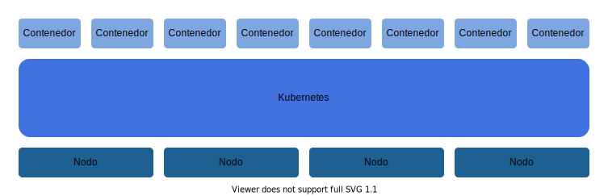

# Notas De Kubernetes

- [Introducción](#introducción)
- [Contenedores En Kubernetes](#contenedores-en-kubernetes)
- [Arquitectura De Kubernetes](#arquitectura-de-kubernetes)
  - [Componentes De Los Nodos Maestro En Kubernetes](#componentes-de-los-nodos-maestro-en-kubernetes)
  - [Componentes De Los Nodos Esclavo En Kubernetes](#componentes-de-los-nodos-esclavo-en-kubernetes)
- [Sistemas Declarativos E Imperativos En Kubernetes](#sistemas-declarativos-e-imperativos-en-kubernetes)
- [Redes En Kubernetes](#redes-en-kubernetes)

 

## Introducción

[Kubernetes](https://Kubernetes.io/es/docs/concepts/overview/what-is-Kubernetes/) es la plataforma de orquestación de contenedores más popular actualmente en el desarrollo profesional, esto en gran parte es gracias a que Kubernetes apunta a ser una plataforma declarativa donde no se indique paso a paso todo lo que debe hacer la infraestructura si no que apunta a que se indique el estado deseado de esta y Kubernetes se encarga de llegar a ese estado deseado, lo que hace más fácil la administración de la infraestructura, Kubernetes además pertenece al [CNCF](https://www.cncf.io/), lo que le da un enorme respaldo como plataforma de orquestación de contenedores, el principal trabajo de Kubernetes es desplegar y gestionar contenedores en un cluster basándose en pods, algunas de las principales ventajas de utilizar Kubernetes como plataforma para desplegar aplicaciones contenerizadas son:

- Al ejecutar varias réplicas del mismo contenedor garantiza que todas las réplicas están funcionando.
- Provee un balanceador de carga interno y externo para todos los servicios, por lo que no hace falta instalar balanceadores de carga o servicios de proxy inverso.
- Permite definir varios mecanismos para hacer restauraciones y despliegues de un servicio.
- Permite definir políticas de auto scaling.
- Permite manejar muy en detalle los trabajos programados.
- Permite definir políticas de roles.

En Kubernetes un pod es una agrupación de contenedores que se ejecutan en el mismo host y que además comparten un namespace o interfaz de red, por lo que todos los contenedores dentro de un pod tienen la misma IP, gracias a esto todos los contenedores que están dentro de un pod se ven unos a otros como procesos ejecutándose dentro del mismo sistema, además en un pod pueden haber varios tipos de contenedores, lo que permite tener en un pod varios tipos de aplicaciones que necesariamente deben trabajar juntas.
Cuando se escala algo en Kubernetes no se agregan más contenedores, se agregan más pods.

 

## Contenedores En Kubernetes

Los contenedores en Kubernetes o en cualquier otra plataforma que use contenedores son entidades que no están definidas dentro del sistema operativo como las máquinas virtuales, los contendores son abstracciones puramente lógicas, que son el resultado de combinar varias tecnologías potenciando unas con otras para generar ambientes de ejecución aislados equivalentes a los de una máquina virtual, sin ser máquinas virtuales con sistemas operativos aislados, de hecho todos los contenedores comparten un mismo sistema operativo. Las tres principales tecnologías que hacen posibles los contenedores en Kubernetes y en la mayoría de las plataformas que usan contenedores son:

- **cgroups:** También llamados control groups son los encargados de que un proceso tenga aislados sus recursos, principalmente memoria, disco, red y cpu, gracias a los cgroups se puede indicar al kernel de Linux con precisión qué recursos que puede usar un contenedor.
- **chroot:** Permite llamar al contenedor como un proceso aislado cambiando su directorio raíz, gracias a chroot un contenedor tiene acceso a su directorio de trabajo sin tener acceso a los demás directorios del sistema de archivos del host.
- **namespaces:** Permite aislar el contenedor en un SandBox de tal modo que el contenedor no pueda ver otros recursos del sistema operativo o de los demás contenedores, los namespaces además se dividen en varios tipos, pero los más importantes son:

  - **mount namespace:** Permite que un proceso tenga una visibilidad reducida de los directorio de trabajo.
  - **networking namespace:** Permite que cada contenedor tenga sus recursos de red separados y que los recursos de un contenedor no interfiera con los de los demás contenedores.
  - **process id namespace:** Permite que los procesos secundarios se aniden en el proceso principal establecido al iniciar el contenedor, de tal modo que al finalizar el proceso principal se finalice la ejecución del contenedor.

 

## Arquitectura De Kubernetes

La arquitectura de Kubernetes se basa en dos tipos de nodos, al igual que la mayoría de los sistemas de cómputo distribuido los nodos se dividen en maestro y esclavo, los maestros, que son designados usando el algoritmo [**raft**](https://www.freecodecamp.org/news/in-search-of-an-understandable-consensus-algorithm-a-summary-4bc294c97e0d/) son los encargados de administrar todos los recursos del cluster y de la asignacion de las tareas, mientras que los esclavos se encargan de ejecutar todas las tareas que les son asignadas por los maestros, Kubernetes permite tener maestros redundantes ademas de poder utilizar mas de un maestro al tiempo, de tal modo que si un maestro falla por alguna razon este puede ser reemplazado casi de inmediato, ademas, en caso de que no se pueda reemplazar y el cluster no disponga de nodos maestro que lo reemplacen los demas componentes del cluster seguiran funcionando, simplemente el cluster no se podra administrar hasta que no se asigne un nuevo nodo maestro que lo controle.
Kubernetes para comunicarse con los nodos maestro utiliza una API, todas las acciones de administración tiene que pasar por esta API para llegar a los nodos maestro, además del API Kubernetes da una interfaz de usuario y un CLI, ambos utilizan el API para comunicarse con los nodos maestro, pero también se pueden enviar las instrucciones de administración directamente al API.

 

### Componentes De Los Nodos Maestro En Kubernetes

- **Etcd:** Key value store que permite que el cluster esté altamente disponible.
- **Servidor API:** El servidor API es a donde llegan todas las conexiones internas y externas del cluster, como los agentes de Kubernetes, el CLI, el dashboard y demás. Cuando un nodo maestro falla solo se pierde el API que se usa para conectarse a ese nodo.
- **Scheduler:** Se encarga de ubicar los pods en los diferentes nodos, asignar las tareas y administrar los flujos de trabajo, revisando siempre las restricciones y los recursos disponibles de cada nodo.
- **Controller Manager:** Es un proceso que está en un ciclo de reconciliación constante buscando llegar al estado deseado del cluster con base al modelo declarativo con el que se le dan instrucciones a Kubernetes, los control manager además pueden ser de varios tipos, algunos de los más usados son:

  - **Deployment manager**
  - **Replica manager**
  - **Service manager**

 

### Componentes De Los Nodos Esclavo En Kubernetes

- **Kubelet:** Los Kubelet son agentes de Kubernetes que se conectan con el scheduler y solicitan recursos (pods o contenedores) para ejecutar. Además los Kubelet monitorean los pods constantemente para saber si se están ejecutando correctamente, monitorea también los recursos disponibles y comunica constantemente al scheduler el estado de los recursos y las tareas.
- **Kube-proxy:** Se encarga de balancear el tráfico que se mueve entre los contenedores o servicios.

 

## Sistemas Declarativos E Imperativos En Kubernetes

En Kubernetes todo se crea a través de una especificación en un archivo yml o manifest, estos archivos pueden variar segun la configuracion de Kubernetes, la cual puede ser declarativa o imperativa, en el modo declarativo la especificación entregada a Kubernetes indica el estado deseado del cluster y Kubernetes trata de converger al estado deseado que le fue proporcionado, cuando Kubernetes está configurado en modo declarativo constantemente revisa los cambios en el sistema y si algo falla calcula la diferencia entre el estado deseado, el estado actual y trata de que el estado actual converja hacia el estado deseado, por lo que al usar una configuración declarativa es totalmente necesario que el estado deseado pueda ser computado y comparado con el actual. Cuando la configuración es imperativa los archivos de configuración se componen de una serie de pasos que Kubernetes sigue ciegamente, su principal desventaja respecto a los sistemas declarativos es que al no proveer un contexto en caso de fallo del sistema debe iniciar desde cero su ejecución.

 

## Redes En Kubernetes

Las redes en todos los clusters son fundamentales, ya que es mediante una red que se comunican todos los nodos del cluster, las redes en un cluster de Kubernetes deben obedecer las siguientes reglas para que el cluster funcione correctamente.

- Todos los nodos en un cluster de Kubernetes se configuran bajo el mismo segmento de red, esto para que todos los pod, servicios y máquinas del cluster se puedan comunicar fácilmente unos con otros.
- Los nodos del cluster deben conectarse entre sí sin usar NAT, por lo que cada nodo debe tener una dirección IP asignada.
- Los pods del cluster, al igual que los nodos, deben conectarse entre sí sin usar NAT, por lo que cada nodo debe tener una dirección IP asignada.
- En Kubernetes los pods a nivel de red en el modelo [**OSI**](https://www.networkworld.com/article/3239677/the-osi-model-explained-and-how-to-easily-remember-its-7-layers.html) trabajan en capa 3 y los servicios en capa 4, por lo que es lo mas adecuado configurar segmentos de red diferentes para los servicios y para los pods, esto para evitar posibles colisiones entre el trafico de unos y otros.

Observaciones adicionales sobre las redes en Kubernetes.

- Kubertenets utiliza un CNI (Container Network Interface) para cambiar las reglas de enrutamiento y así lograr que incluso cuando se usan segmentos de red diferentes para servicios y pueda haber comunicación entre ellos.
- Kube-proxy es el componente de Kubernetes que permite realizar conexiones entre pods y contenedores usando iptables para enrutar las conexiones de un componente con otro.

 
