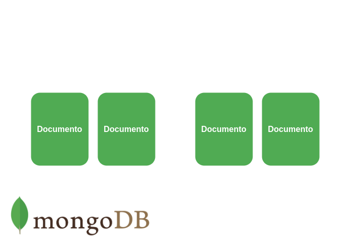
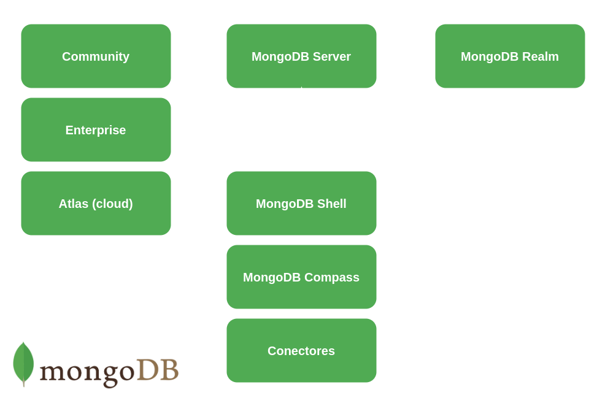

# MongoDB

[**MongoDB**](https://docs.mongodb.com/) es uno de los sistemas de bases de datos no relacionales más usados en el desarrollo profesional, es ampliamente usado en todo tipo de entornos de desarrollo gracias a su flexibilidad y facilidad de uso, que se deben en gran parte a que MongoDB se basa en documentos similares a los documentos JSON. Una de las mejores características de MongoDB es que en su versión Atlas permite crear sistemas distribuidos de bases de datos, por lo que usando MongoDB Atlas es totalmente factible tener un cluster de máquinas en la nube dedicadas al almacenamiento de los datos de una o varias bases de datos, esta característica hace que escalar un sistema de bases de datos basado en MongoDB Atlas sea extremadamente fácil ya que solo hace falta agregar más nodos al cluster. Otra de las características clave de MongoDB es que es "Schema Less" en todas sus versiones, por lo que los documentos dentro de una misma colección pueden tener estructuras totalmente diferentes sin afectar el funcionamiento de MongoDB y como si fuera poco las consultas de MongoDB también son extremadamente eficientes por el hecho de ser una base de datos no relacional basada en documentos que además permite indexación.

<br><br>

## Componentes principales de MongoDB

<p align="center">

</p>

<br>

### Bases de datos

Las bases de datos en MongoDB son los espacios de almacenamiento como tal en los que se guardan las colecciones, cada base de datos tiene su propio archivo dentro del sistema de archivos de la máquina en la que se ejecuta MongoDB, además en un cluster de MongoDB pueden haber múltiples bases de datos.

<br>

### Colecciones

Las colecciones en MongoDB son agrupaciones de documentos, son equivalentes a las tablas de las bases de datos relacionales y además en el caso de MongoDB no imponen un esquema fijo que debían seguir los documentos de la colección.

<br>

### Documentos

Los documentos dentro de MongoDB son registros dentro de cada colección, son análogos a los documentos [**JSON**](https://www.mongodb.com/json-and-bson), pero en realidad son documentos [**BSON**](https://www.mongodb.com/json-and-bson), que son documentos binarios basados en JSON, usar BSON hace más fácil entender la estructura de cada documento y además permite almacenar una gran variedad de [**tipos de datos**](https://docs.mongodb.com/manual/reference/bson-types/) gracias a la cantidad de formatos que soporta BSON. Los documentos son la unidad más básica dentro de MongoDB y no pueden ser mayores a 16 Mb.

<br><br>

## Ecosistema de MongoDB

<p align="center">

</p>

<br>

### MongoDB Server

Es el motor de base de datos como tal, es donde se guardan los datos y es el encargado de realizar las operaciones que le son solicitadas, el MongoDB Server tiene tres versiones.

#### Atlas

Es la versión en nube de una base de datos MongoDB.

#### Community

Es la versión de código abierto de MongoDB, respecto a la versión enterprise solo hay un par de características de menos como diferencia.

#### Enterprise

Es la versión de pago de MongoDB, incluye ciertas características extra respecto a la versión community.

<br>

### MongoDB Shell

Es la consola con la que se interactúa con el MongoDB Server.

<br>

### MongoDB Compass

Es una interfaz gráfica desarrollada por los mismos desarrolladores del MongoDB Server, con la que se puede interactuar con el MongoDB Server de una forma más amigable.

<br>

### Conectores de MongoDB

Son las [**librerías**](https://docs.mongodb.com/drivers/) dentro de cada lenguaje de programación que se usan para interactuar con el MongoDB Server.

<br>

### MongoDB Realm

Es una versión lite de MongoDB que se puede instalar en dispositivos móviles.

<br><br>

## Relaciones entre documentos en MongoDB

En MongoDB y en el resto de sistemas de bases de datos no relacionales basadas en documentos suele haber solo dos formas para expresar las relaciones entre documentos, usando documentos anidados o usando referencias dentro de un documento a otro documento. Los documentos anidados suelen usarse en relaciones **uno a uno**, ya que se aprovecha más la estructura de las bases de datos no relacionales para hacer solo una búsqueda. Si la relación es de **uno a muchos** lo adecuado es usar referencias si el documento que se va a relacionar va a estar actualizándose constantemente, ya que de esta forma las actualizaciones pueden hacerse en un solo documento y los cambios se verán reflejados en todos los documentos con los que está relacionado, usar referencias hace más lentas las búsquedas ya que no se aprovecha la estructura no relacional de MongoDB, razón por la cual hace falta recorrer más de una vez la base de datos buscando el documento referenciado a cambio de facilitar la actualización de los documentos relacionados y optimizar el almacenamiento, sin embargo es lo ideal en este tipo de escenarios. Si por el contrario el documento que se va a relacionar en una relación **uno a muchos** no se va a actualizar de forma constante se puede anidar simplemente como una copia dentro de cada documento con el que se relaciona, ya que de nuevo, de esta forma se aprovecha más la estructura de las bases de datos no relacionales para hacer solo una búsqueda.

<br><br>

## Manejo de MongoDB Compass

[**MongoDB Compass**](https://docs.mongodb.com/compass/current/) es la interfaz gráfica de MongoDB, al igual que el shell de MongoDB permite realizar todo tipo de operaciones, con la ventaja de tener una interfaz gráfica más amigable y sin ser necesario mucho conocimiento sobre el lenguaje de queries de MongoDB, para conectar Compass es necesario usar la siguiente sintaxis.

```Unknown
mongodb://[ip de la máquina que tiene MongoDB Server]:[puerto en el que está expuesto mongo, normalmente 27017]
```

Ejemplo:

```Unknown
mongodb://127.0.0.1:27017
```

<br><br>

## Manejo de MongoDB Shell

El shell de MongoDB o [**MongoDB Shell**](https://docs.mongodb.com/manual/mongo/) es la interfaz interactiva basada en JavaScript que se usa para interactuar de forma directa con el MongoDB Server mediante la terminal, además de poder realizar acciones simples en MongoDB Shell también se pueden crear [**scripts**](https://docs.mongodb.com/manual/tutorial/write-scripts-for-the-mongo-shell/), por lo que se pueden automatizar varios tipos de tareas o consultas en concreto usando el shell.

<br>

### Iniciar shell

```Unknown
mongo
```

<br>

### Limpiar shell

```Unknown
ctrl + l
```

<br>

### Ver bases de datos disponibles

```Unknown
show dbs
```

<br>

### Crear nueva base de datos o usar una ya creada

```Unknown
use [nombre de la nueva base de datos]
```

<br>

### Ver nombre de la base de datos a la que está conectado el shell

```Unknown
db
```

<br>

### Ver colecciones disponibles en la base de datos

```Unknown
show collections
```

<br>

### Ver funciones disponibles

#### En una base de datos

```Unknown
[nombre de la base de datos].help()
```

Ejemplo:

```JavaScript
db.help()
```

#### En una colección

```Unknown
[nombre de la base de datos].[nombre de la colección].help()
```

Ejemplo:

```JavaScript
db.inventory.help()
```

<br>

### Insertar documentos en una colección

MongoDB por defecto no crea bases de datos vacías, por lo que es necesario luego de crear una nueva base de datos crear al menos una colección y un documento, si la colección en la que se quiere insertar el documento no existe MongoDB crea una nueva colección con el nombre indicado.\
Al insertar un documento el id se puede especificar usando el tag **\_id**, si no se indica el id del documento usando este tag MongoDB asigna al documento un id por defecto, además el id no se puede repetir, por lo que si se ingresa un documento con un id que ya existe la operación fallará, por lo que es una buena práctica dejar que MongoDB genere el id de forma automática.

#### Inserción individual

```Unknown
[nombre de la base de datos].[nombre de la colección].insertOne([documento en formato JSON])
```

Ejemplo:

```JavaScript
db.inventory.insertOne(
    {size: {h: 28, w: 35.5, uom: "cm"}, tags: ["cotton"], item: "canvas", qty: 100}
)
```

#### Inserción grupal

```Unknown
[nombre de la base de datos].[nombre de la colección].insertMany([arreglo de documentos en formato JSON])
```

Ejemplo:

```JavaScript
db.inventory.insertMany(
    [
        {item: "sketch pad", qty: 95, size: {h: 22.85, w: 30.5, uom: "cm"}, status: "A"},
        {item: "postcard", qty: 45, size: {h: 10, w: 15.25, uom: "cm"}, status: "A"},
        {item: "sketchbook", qty: 80, size: {h: 14, w: 21, uom: "cm"}, status: "A"}
    ]
)
```

<br>

### Documentos de filtros en formato JSON

Los documentos de filtros son parte fundamental de la mayoría de las operaciones [**CRUD**](https://docs.mongodb.com/manual/crud/) com MongoDB, ya que permiten, como su nombre indica, filtrar los documentos resultantes de una búsqueda, para esto MongoDB dispone de varios [**operadores**](https://docs.mongodb.com/manual/reference/operator/) que se usan en el MongoDB Shell para realizar todo tipo de operaciones necesarias para filtrar datos, a continuación se muestran algunos ejemplos de la sintaxis de algunos de los operadores más comunes.

#### equal

```JavaScript
db.inventory.find(
    {item: "canvas"}
)
```

#### lower than

```JavaScript
db.inventory.find(
    qty: {$lt:30}
)
```

#### and

```JavaScript
db.inventory.find(
    {
        item: "canvas",
        qty: {$lt:30}
    }
)
```

#### or

```JavaScript
db.inventory.find(
    {
        $or:[
            {status: "A"},
            {qty: {$lt:30}}
            ]
    }
)
```

<br>

### Buscar documentos en una colección

#### Búsqueda individual

```Unknown
[nombre de la base de datos].[nombre de la colección].findOne([documento de filtros en formato JSON], [proyección en formato JSON])
```

Ejemplo:

```JavaScript
db.inventory.findOne(
    {item: "canvas"},
    {_id:0, item:1, status:1}
)
```

En el ejemplo anterior se usa una proyección y un filtro, el filtro **({item: "canvas"})** se usa para retornar solamente los documentos que cumplan con ciertos parámetros y la proyección **({\_id:0, item:1, status:1})** asegura que se muestren solo ciertos campos de los documentos retornados, los filtros son parte fundamental de cualquier operación de búsqueda, mientras que las proyecciones pueden facilitar en gran medida la lectura de los resultados omitiendo la información innecesaria.\
Al usar el método **findOne** solamente se retorna el primer documento que cumpla con las condiciones de la búsqueda según el orden natural de los documentos de MongoDB.

#### Búsqueda grupal

```Unknown
[nombre de la base de datos].[nombre de la colección].find([documento de filtros en formato JSON], [proyección en formato JSON])
```

Ejemplo:

```JavaScript
db.inventory.find(
    {item: "canvas"},
    {_id:0, item:1, status:1}
)
```

Al usar el método **find** se retornan todos los documento que cumpla con las condiciones de la búsqueda, el método **find** al igual que el método **findOne** y la gran mayoría de los métodos de búsqueda en MongoDB admite el uso de filtros y proyecciones.

El método find además se puede combinar con otros métodos como:

- **pretty():** para imprimir de una forma más legible los documentos resultantes de la búsqueda.
- **count():** para contar el número de documentos resultantes de la búsqueda.
- **explain('executionStats'):** Muestra las estadísticas de la ejecución del query.

<br>

### Actualizar documentos en una colección

#### Actualización individual

```Unknown
[nombre de la base de datos].[nombre de la colección].updateOne([documento de filtros en formato JSON], [JSON])
```

Ejemplo:

```JavaScript
db.inventory.updateOne(
    {
        status: "A"
    },
    {
        $set: {status: "B"},
    }
)
```

#### Actualización grupal

```Unknown
[nombre de la base de datos].[nombre de la colección].updateMany([documento de filtros en formato JSON], [JSON])
```

Ejemplo:

```JavaScript
db.inventory.updateMany(
    {
        status: "A"
    },
    {
        $set: {status: "B"},
    }
)
```

<br>

### Eliminar documentos de una colección

#### Eliminación individual

```Unknown
[nombre de la base de datos].[nombre de la colección].deleteOne([documento de filtros en formato JSON])
```

Ejemplo:

```JavaScript
db.inventory.deleteOne(
    {status: "B"}
)
```

El documento eliminado con deleteOne siempre es el primer documento que cumple con las condiciones del JSON de filtros según el orden natural de MongoDB.

#### Eliminación grupal

```Unknown
[nombre de la base de datos].[nombre de la colección].deleteMany([documento de filtros en formato JSON])
```

Ejemplo:

```JavaScript
db.inventory.deleteMany(
    {status: "B"}
)
```

<br>

### Agregaciones

Las [**agregaciones**](https://docs.mongodb.com/manual/aggregation/) en MongoDB son operaciones avanzadas que se pueden realizar en MongoDB.

<br>

### Manejo de índices

Los [**índices**](https://docs.mongodb.com/manual/indexes/) en MongoDB se usan para evitar que MongoDB tenga que hacer un escaneo completo de toda una colección en búsqueda de un elemento, facilitando así los querys, los tipos de índices disponibles en MongoDB se listan a continuación.

- **De un solo campo:**
- **Multi llave:**
- **Compuestos:**
- **Geoespaciales:**
- **De texto:**
- **Hashed:**

#### Listar índices

```Unknown
[nombre de la base de datos].[nombre de la colección].getIndexes()
```

Ejemplo:

```JavaScript
db.inventory.getIndexes()
```

#### Crear nuevo índice

```Unknown
[nombre de la base de datos].[nombre de la colección].createIndex({[nombre del campo que se usará como índice]:[tipo de índice]})
```

Ejemplo:

```JavaScript
db.inventory.createIndex({nombre: "text"})
```

<br>

<br><br>
