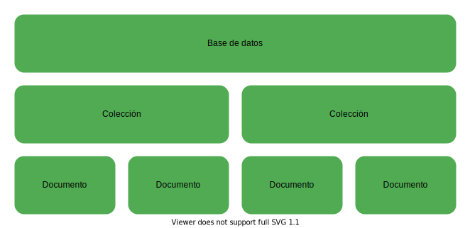
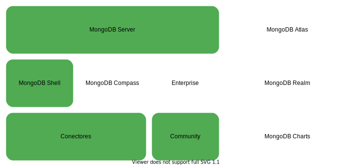

# MongoDB

[**MongoDB**](https://docs.mongodb.com/) es uno de los sistemas de bases de datos no relacionales más usados en el desarrollo profesional, es ampliamente usado en todo tipo de entornos de desarrollo gracias a su flexibilidad y facilidad de uso, que se deben en gran medida al hecho de que MongoDB se basa en documentos similares a los documentos JSON. Una de las mejores características de MongoDB es que permite crear sistemas distribuidos de bases de datos, por lo que usando MongoDB es totalmente factible tener un cluster de máquinas dedicadas al almacenamiento de los datos de una o varias bases de datos, esta característica hace que escalar un sistema de bases de datos basado en MongoDB sea extremadamente fácil ya que solo hace falta agregar más nodos al cluster. Otra de las principales características clave de MongoDB es que es "Schema Less" en todas sus versiones, por lo que los documentos dentro de una misma colección pueden tener estructuras totalmente diferentes sin afectar el funcionamiento o el rendimiento de MongoDB, y como si fuera poco las consultas de MongoDB también son extremadamente eficientes por el hecho de ser una base de datos no relacional basada en documentos que además permite indexación, por lo que se puede optimizar incluso más su rendimiento mediante índices.

<br>

## Tabla de contenidos

- [**Componentes principales de MongoDB**](#componentes-principales-de-mongodb)
  - [Bases de datos](#bases-de-datos)
  - [Colecciones](#colecciones)
  - [Documentos](#documentos)
- [**Ecosistema de MongoDB**](#ecosistema-de-mongodb)
  - [MongoDB Server](#mongodb-server)
  - [MongoDB Shell](#mongodb-shell)
  - [Conectores de MongoDB](#conectores-de-mongodb)
- [**Relaciones entre documentos en MongoDB**](#relaciones-entre-documentos-en-mongodb)
- [**Conexión con MongoDB Server**](#conexi%C3%B3n-con-mongodb-server)
- [**Operaciones básicas en MongoDB Shell**](#operaciones-b%C3%A1sicas-con-mongodb-shell)
  - [Iniciar shell](#iniciar-shell)
  - [Limpiar shell](#limpiar-shell)
  - [Ver bases de datos disponibles](#ver-bases-de-datos-disponibles)
  - [Ver colecciones disponibles](#ver-colecciones-disponibles)
  - [Crear nueva base de datos o usar una ya creada](#crear-nueva-base-de-datos-o-usar-una-ya-creada)
  - [Ver nombre de la base de datos a la que está conectado el shell](#ver-nombre-de-la-base-de-datos-a-la-que-est%C3%A1-conectado-el-shell)
  - [Ver funciones disponibles](#ver-funciones-disponibles)
- [**Operaciones con bases de datos en MongoDB Shell**](#operaciones-con-bases-de-datos-en-mongodb-shell)
- [**Operaciones con colecciones y documentos en MongoDB Shell**](#operaciones-con-colecciones-y-documentos-en-mongodb-shell)
  - [Documentos de filtros](#documentos-de-filtros)
  - [Insertar documentos en una colección](#insertar-documentos-en-una-colecci%C3%B3n)
  - [Buscar documentos en una colección](#buscar-documentos-en-una-colecci%C3%B3n)
  - [Actualizar documentos de una colección](#actualizar-documentos-de-una-colecci%C3%B3n)
  - [Eliminar documentos de una colección](#eliminar-documentos-de-una-colecci%C3%B3n)
  - [Operaciones de agregación](#operaciones-de-agregaci%C3%B3n)
  - [Manejo de índices](#manejo-de-%C3%ADndices)

<br>

## Componentes principales de MongoDB

<p align="center">

</p>

### Bases de datos

Las [**bases de datos**](https://docs.mongodb.com/manual/core/databases-and-collections/#databases) en MongoDB son los espacios de almacenamiento como tal en los que se guardan las colecciones, cada base de datos tiene su propio archivo dentro del sistema de archivos del host en el que se ejecuta MongoDB, además en un cluster de MongoDB Atlas pueden haber múltiples bases de datos distribuidas o replicadas entre los diferentes nodos del cluster.

### Colecciones

Las [**colecciones**](https://docs.mongodb.com/manual/core/databases-and-collections/#collections) en MongoDB son agrupaciones de documentos, son equivalentes a las tablas de las bases de datos relacionales y además en el caso de MongoDB no se imponen esquemas fijos que deban seguir los documentos una misma colección.

### Documentos

Los [**documentos**](https://docs.mongodb.com/manual/core/document/) en MongoDB son registros dentro de cada colección, la estructura de los documentos de MongoDB es similar a la de los documentos JSON, pero en realidad son documentos BSON, que son documentos JSON binarios, usar BSON hace fácil entender la estructura de cada documento y además permite almacenar una gran variedad de tipos de datos gracias a la cantidad de formatos que soporta BSON. Los documentos además son la unidad más básica dentro de MongoDB y no pueden ser mayores a 16 megabytes.

<br>

## Ecosistema de MongoDB

<p align="center">

</p>

### MongoDB Server

El servidor de MongoDB es el servidor encargado de gestionar las bases de datos como tal, sus principales funciones son almacenar las bases de datos en el sistema de archivos del host, mantener disponibles las bases de datos y realizar el cruce de datos y la entrega de resultados de todas las peticiones que se le hagan. Al igual que la gran mayoría del software de código abierto el servidor de MongoDB tiene dos versiones, una versión community y una enterprise, con la diferencia de que la versión enterprise gana algunas características adicionales respecto a la versión community.

### MongoDB Shell

Es shell de MongoDB es el shell con la que se interactúa de forma directa con el servidor de MongoDB.

### Conectores de MongoDB

Los conectores de MongoDB son todas las [**bibliotecas**](https://docs.mongodb.com/drivers/) dentro de los diferentes lenguajes de programación que se usan para interactuar con el servidor de MongoDB.

<br>

## Relaciones entre documentos en MongoDB

En MongoDB y en el resto de sistemas de bases de datos no relacionales basadas en documentos suele haber solo dos formas para expresar las relaciones entre documentos, usando documentos anidados o usando referencias dentro de un documento a otro documento. Los documentos anidados suelen usarse en relaciones **uno a uno**, ya que se aprovecha más la estructura de las bases de datos no relacionales para hacer solo un scan. Si la relación es de **uno a muchos** lo adecuado es usar referencias si el documento que se va a relacionar va a estar actualizándose constantemente, ya que de esta forma las actualizaciones pueden hacerse en un solo documento y los cambios se verán reflejados en todos los documentos con los que está relacionado, usar referencias hace más lentas las búsquedas ya que no se aprovecha la estructura no relacional de MongoDB, razón por la cual hace falta hacer más de un scan a cambio de facilitar la actualización de los documentos relacionados y optimizar el almacenamiento, sin embargo es lo ideal en este tipo de escenarios. Si por el contrario el documento que se va a relacionar en una relación **uno a muchos** no se va a actualizar de forma constante se puede anidar simplemente como una copia dentro de cada documento con el que se relaciona sí no importa el almacenamiento, ya que de nuevo, de esta forma se aprovecha más la estructura de las bases de datos no relacionales para hacer un solo scan.

Ejemplo de documento anidado:

```JSON
{
    "nombre": "Pedro",
    "apellido": "Perez",
    "lugar_residencia": {
        "ciudad": "Bogotá",
        "departamento": "Cundinamarca",
        "direccion": "Calle 175 #64-11"
    },
    "edad": 36
}
```

Ejemplo de múltiples documentos anidados:

```JSON
{
    "nombre": "Pedro",
    "apellido": "Perez",
    "lugar_residencia": [
        {
            "ciudad": "Bogotá",
            "departamento": "Cundinamarca",
            "direccion": "Calle 175 #64-11"
        },
        {
            "ciudad": "Neiva",
            "departamento": "Huila",
            "direccion": "Calle 4 #17-11"
        }
    ],
    "edad": 36
}
```

Ejemplo de documento referenciado:

```JSON
{
    "id": "62a873996f6aaaa78dac39c0d5c36a39",
    "nombre": "Perez",
    "apellido": "Perez",
    "edad": 36
}
```

```JSON
{
    "autor": "62a873996f6aaaa78dac39c0d5c36a39",
    "nombre": "Perez",
    "ano_publicacion": 2021
}
```

Ejemplo de múltiples documentos referenciados:

```JSON
{
    "id": "62a873996f6aaaa78dac39c0d5c36a39",
    "nombre": "Perez",
    "apellido": "Perez",
    "edad": 36
}
```

```JSON
{
    "id": "a85ba64adf6bf75e64b221a3171b0269",
    "nombre": "Felipe",
    "apellido": "Perez",
    "edad": 32
}
```

```JSON
{
    "autor": ["62a873996f6aaaa78dac39c0d5c36a39", "a85ba64adf6bf75e64b221a3171b0269"],
    "nombre": "Perez",
    "ano_publicacion": 2021
}
```

<br>

## Conexión con MongoDB Server

Para establecer una conexión entre MongoDB con cualquier aplicación o driver, independientemente de la versión de MongoDB Server, es necesario usar un [**string de conexión en formato uri**](https://docs.mongodb.com/manual/reference/connection-string/#connection-string-uri-format), a continuación se muestra el formato estándar para establecer una conexión entre una aplicación y un MongoDB Server ambos dentro del mismo host.

```unknown
mongodb://<ip de la máquina que tiene MongoDB Server>:<puerto en el que está expuesto mongo, normalmente 27017>
```

Ejemplo:

```unknown
mongodb://127.0.0.1:27017
```

<br>

## Operaciones básicas con MongoDB Shell

El shell de MongoDB o [**MongoDB Shell**](https://docs.mongodb.com/manual/mongo/) es una interfaz interactiva basada en JavaScript que se usa para interactuar de forma directa con el MongoDB Server mediante la terminal, al ser un shell basado en JavaScript el shell de MongoDB permite usar comandos con sintaxis de [**shell**](https://docs.mongodb.com/manual/reference/program/mongo/#mongodb-binary-bin.mongo) o comandos con sintaxis de [**JavaScript**](https://docs.mongodb.com/manual/reference/method/), sin embargo la mayoría de las operaciones sólo están disponibles usando la sintaxis de JavaScript, además de poder realizar acciones simples en MongoDB Shell también se pueden crear [**scripts**](https://docs.mongodb.com/manual/tutorial/write-scripts-for-the-mongo-shell/) basados en JavaScript que se ejecuten sobre el shell de MongoDB, por lo que se pueden automatizar varios tipos de tareas o consultas en usando JavaScript.

<br>

### Iniciar shell

```unknown
mongo
```

<br>

### Limpiar shell

```unknown
ctrl + l
```

```unknown
cls
```

<br>

### Ver bases de datos disponibles

```unknown
show databases
```

```unknown
show dbs
```

<br>

### Ver colecciones disponibles

```unknown
show collections
```

<br>

### Crear nueva base de datos o usar una ya creada

```unknown
use <nombre de la nueva base de datos>
```

Ejemplo:

```unknown
use db
```

<br>

### Ver nombre de la base de datos a la que está conectado el shell

```unknown
db
```

<br>

### Ver funciones disponibles

#### En una base de datos

```unknown
<nombre de la base de datos>.help()
```

Ejemplo:

```JavaScript
db.help()
```

#### En una colección

```unknown
<nombre de la base de datos>.<nombre de la colección>.help()
```

Ejemplo:

```JavaScript
db.inventory.help()
```

<br>

## Operaciones con bases de datos en MongoDB Shell

<br>

## Operaciones con colecciones y documentos en MongoDB Shell

<br>

### Documentos de filtros

Los documentos de filtros son parte fundamental de la mayoría de las operaciones [**CRUD**](https://docs.mongodb.com/manual/crud/) com MongoDB, ya que permiten, como su nombre indica, filtrar los documentos resultantes de una búsqueda, para esto MongoDB dispone de varios [**operadores**](https://docs.mongodb.com/manual/reference/operator/) que se usan en el MongoDB Shell para realizar todo tipo de operaciones necesarias para filtrar datos, a continuación se muestran algunos ejemplos de la sintaxis de algunos de los operadores más comunes.

#### equal

```JavaScript
db.inventory.find(
    {item: "canvas"}
)
```

#### lower than

```JavaScript
db.inventory.find(
    qty: {$lt:30}
)
```

#### and

```JavaScript
db.inventory.find(
    {
        item: "canvas",
        qty: {$lt:30}
    }
)
```

#### or

```JavaScript
db.inventory.find(
    {
        $or:[
            {status: "A"},
            {qty: {$lt:30}}
            ]
    }
)
```

<br>

### Insertar documentos en una colección

MongoDB por defecto no crea bases de datos vacías, por lo que es necesario luego de crear una nueva base de datos crear al menos una colección y un documento, si la colección en la que se quiere insertar el documento no existe MongoDB crea una nueva colección con el nombre indicado.\
Al insertar un documento el id se puede especificar usando el tag **\_id**, si no se indica el id del documento usando este tag MongoDB asigna al documento un id por defecto, además el id no se puede repetir, por lo que si se ingresa un documento con un id que ya existe la operación fallará, por lo que es una buena práctica dejar que MongoDB genere el id de forma automática.

#### Inserción individual

```unknown
<nombre de la base de datos>.<nombre de la colección>.insertOne(<documento en formato JSON>)
```

Ejemplo:

```JavaScript
db.inventory.insertOne(
    {size: {h: 28, w: 35.5, uom: "cm"}, tags: ["cotton"], item: "canvas", qty: 100}
)
```

#### Inserción grupal

```unknown
<nombre de la base de datos>.<nombre de la colección>.insertMany(<arreglo de documentos en formato JSON>)
```

Ejemplo:

```JavaScript
db.inventory.insertMany(
    [
        {item: "sketch pad", qty: 95, size: {h: 22.85, w: 30.5, uom: "cm"}, status: "A"},
        {item: "postcard", qty: 45, size: {h: 10, w: 15.25, uom: "cm"}, status: "A"},
        {item: "sketchbook", qty: 80, size: {h: 14, w: 21, uom: "cm"}, status: "A"}
    ]
)
```

<br>

### Buscar documentos en una colección

#### Búsqueda individual

```unknown
<nombre de la base de datos>.<nombre de la colección>.findOne(<documento de filtros en formato JSON>, <proyección en formato JSON>)
```

Ejemplo:

```JavaScript
db.inventory.findOne(
    {item: "canvas"},
    {_id:0, item:1, status:1}
)
```

En el ejemplo anterior se usa una proyección y un filtro, el filtro **({item: "canvas"})** se usa para retornar solamente los documentos que cumplan con ciertos parámetros y la proyección **({\_id:0, item:1, status:1})** asegura que se muestren solo ciertos campos de los documentos retornados, los filtros son parte fundamental de cualquier operación de búsqueda, mientras que las proyecciones pueden facilitar en gran medida la lectura de los resultados omitiendo la información innecesaria.\
Al usar el método **findOne** solamente se retorna el primer documento que cumpla con las condiciones de la búsqueda según el orden natural de los documentos de MongoDB.

#### Búsqueda grupal

```unknown
<nombre de la base de datos>.<nombre de la colección>.find(<documento de filtros en formato JSON>, <proyección en formato JSON>)
```

Ejemplo:

```JavaScript
db.inventory.find(
    {item: "canvas"},
    {_id:0, item:1, status:1}
)
```

Al usar el método **find** se retornan todos los documento que cumpla con las condiciones de la búsqueda, el método **find** al igual que el método **findOne** y la gran mayoría de los métodos de búsqueda en MongoDB admite el uso de filtros y proyecciones.

El método find además se puede combinar con otros métodos como:

- **pretty():** para imprimir de una forma más legible los documentos resultantes de la búsqueda.
- **count():** para contar el número de documentos resultantes de la búsqueda.
- **explain('executionStats'):** Muestra las estadísticas de la ejecución del query.

<br>

### Actualizar documentos de una colección

#### Actualización individual

```unknown
<nombre de la base de datos>.<nombre de la colección>.updateOne(<documento de filtros en formato JSON>, <JSON>)
```

Ejemplo:

```JavaScript
db.inventory.updateOne(
    {
        status: "A"
    },
    {
        $set: {status: "B"},
    }
)
```

#### Actualización grupal

```unknown
<nombre de la base de datos>.<nombre de la colección>.updateMany(<documento de filtros en formato JSON>, <JSON>)
```

Ejemplo:

```JavaScript
db.inventory.updateMany(
    {
        status: "A"
    },
    {
        $set: {status: "B"},
    }
)
```

<br>

### Eliminar documentos de una colección

#### Eliminación individual

```unknown
<nombre de la base de datos>.<nombre de la colección>.deleteOne(<documento de filtros en formato JSON>)
```

Ejemplo:

```JavaScript
db.inventory.deleteOne(
    {status: "B"}
)
```

El documento eliminado con deleteOne siempre es el primer documento que cumple con las condiciones del JSON de filtros según el orden natural de MongoDB.

#### Eliminación grupal

```unknown
<nombre de la base de datos>.<nombre de la colección>.deleteMany(<documento de filtros en formato JSON>)
```

Ejemplo:

```JavaScript
db.inventory.deleteMany(
    {status: "B"}
)
```

<br>

### Operaciones de agregación

Las [**agregaciones**](https://docs.mongodb.com/manual/aggregation/) en MongoDB son operaciones avanzadas que se pueden realizar en MongoDB.

<br>

### Manejo de índices

Los [**índices**](https://docs.mongodb.com/manual/indexes/) en MongoDB se usan para evitar que MongoDB tenga que hacer un escaneo completo de toda una colección en búsqueda de un elemento, facilitando así los querys, los tipos de índices disponibles en MongoDB se listan a continuación.

- **De un solo campo:**
- **Multi llave:**
- **Compuestos:**
- **Geoespaciales:**
- **De texto:**
- **Hashed:**

#### Listar índices

```unknown
<nombre de la base de datos>.<nombre de la colección>.getIndexes()
```

Ejemplo:

```JavaScript
db.inventory.getIndexes()
```

#### Crear nuevo índice

```unknown
<nombre de la base de datos>.<nombre de la colección>.createIndex({<nombre del campo que se usará como índice>:<tipo de índice>})
```

Ejemplo:

```JavaScript
db.inventory.createIndex({nombre: "text"})
```

<br>
