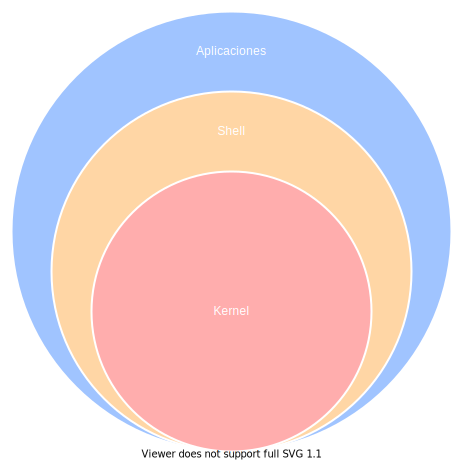

# Notas De Sistemas Linux

- [Introducción](#introducción)
- [Comandos Bash](#comandos-bash)
  - [Comandos Básicos](#comandos-básicos)
  - [Comandos De Compresión De Archivos](#comandos-de-compresión-de-archivos)
- [Scripts Bash](#scripts-bash)
  - [Crear Un Script Bash](#crear-un-script-bash)
  - [Otorgar Permisos De Ejecución Al Script](#otorgar-permisos-de-ejecución-al-script)
  - [Establecer Bash Como Intérprete Del Script](#establecer-bash-como-intérprete-del-script)
  - [Declaración De Variables En Bash](#declaración-de-variables-en-bash)
  - [Lectura De Variables En Bash](#lectura-de-variables-en-bash)
  - [Sustitución De Comandos En Variables En Bash](#sustitución-de-comandos-en-variables-en-bash)
  - [Capturar Entradas Del Usuario En Bash](#capturar-entradas-del-usuario-en-bash)
  - [Operadores Aritméticos En Bash](#operadores-aritméticos-en-bash)
    - [Suma](#suma)
    - [Resta](#resta)
    - [Multiplicación](#multiplicación)
    - [División](#división)
    - [Residuo](#residuo)
  - [Operadores Relacionales En Bash](#operadores-relacionales-en-bash)
    - [Operador Mayor](#operador-mayor)
    - [Operador Menor](#operador-menor)
    - [Operador Mayor O Igual](#operador-mayor-o-igual)
    - [Operador Menor O Igual](#operador-menor-o-igual)
    - [Operador Igual](#operador-igual)
    - [Operador Diferente](#operador-diferente)
  - [Operadores De Asignación En Bash](#operadores-de-asignación-en-bash)
    - [Sumar A Numa Numb](#sumar-a-numa-numb)
    - [Restar A Numa Numb](#restar-a-numa-numb)
    - [Multiplicar A Numa Por Numb](#multiplicar-a-numa-por-numb)
    - [Dividir A Numa Entre Numb](#dividir-a-numa-entre-numb)
    - [Residuo De Numa Entre Numb](#residuo-de-numa-entre-numb)
  - [Manejo De Secuencias En Bash](#manejo-de-secuencias-en-bash)
  - [Manejo De Arreglos En Bash](#manejo-de-arreglos-en-bash)
  - [Manejo De Tablas En Bash](#manejo-de-tablas-en-bash)
  - [Condicionales Con If Y Else En Bash](#condicionales-con-if-y-else-en-bash)
  - [Validación De Entradas Del Usuario Con Condicionales If Y Regex En Bash](#validación-de-entradas-del-usuario-con-condicionales-if-y-regex-en-bash)
  - [Condicionales Con Case En Bash](#condicionales-con-case-en-bash)
  - [Ciclos While En Bash](#ciclos-while-en-bash)
  - [Ciclos For En Bash](#ciclos-for-en-bash)
  - [Sentencias Break Y Continue En Bash](#sentencias-break-y-continue-en-bash)
  - [Ejecutar Un Script Bash](#ejecutar-un-script-bash)
  - [Manejo De Argumentos En Bash](#manejo-de-argumentos-en-bash)
  - [Creación De Funciones En Bash](#creación-de-funciones-en-bash)
  - [Manejo De Opciones En Bash](#manejo-de-opciones-en-bash)
  - [Depuración En Bash](#depuración-en-bash)
  - [Lectura De Archivos Con Bash](#lectura-de-archivos-con-bash)
    - [Lectura Normal Con Cat](#lectura-normal-con-cat)
    - [Lectura Normal Con Cat Y Sustitución De Variable](#lectura-normal-con-cat-y-sustitución-de-variable)
    - [Lectura Linea A Linea Con Ifs Y While](#lectura-linea-a-linea-con-ifs-y-while)
  - [Escritura De Archivos Con Bash](#escritura-de-archivos-con-bash)

<br>

## Introducción

los sistemas operativos linux son sistemas operativos de tipo unix, que suelen ser de código abierto, multiplataforma, multiusuario y multitarea. estos sistemas operativos están formados por la combinación de varios proyectos, dentro de los cuales destacan el entorno **gnu**, así como el núcleo del sistema o kernel **linux**, de ahí la denominación técnica **gnu/linux** que hace referencia a los dos componentes principales de este tipo de sistemas operativos, a pesar de que cotidianamente se les llame solo sistemas linux estos sistemas también están formados en una enorme parte por componentes del proyecto gnu, sin embargo, por simple facilidad se les seguirá llamando sistemas linux en el resto del documento.

<p align="center">

</p>

los tres componentes principales de todos los sistemas linux son:

- **kernel:** el kernel es el núcleo de cualquier sistema operativo, en el caso de los sistemas linux el nombre del kernel es linux, el kernel es el componente del sistema que gestiona todos los recursos de hardware, el acceso seguro a estos y los periféricos conectados al computador.
- **shell:** el shell en cualquier sistema basado en unix, como los sistemas linux, es el intérprete de comandos del sistema operativo, de forma resumida el shell es un programa que permite al usuario ejecutar comandos, mediante los cuales se pueden dar instrucciones de forma directa al kernel del sistema operativo, el shell además permite que los comandos de aplicaciones que trabajan con lenguajes de alto nivel sean procesados y ejecutados en un lenguaje de bajo nivel, permitiendo así que estas aplicaciones interactúen con el kernel.
- **aplicaciones:** las aplicaciones son los programas con los que se interactúa para realizar alguna actividad en concreto, en los sistemas linux toda aplicación por debajo estas ejecutan acciones directamente en el kernel.

en los sistemas linux existen varios tipos de shell de las cuales el usuario puede decidir cual usar, algunos de estos son:

- **csh:** en una shell diseñada para que los usuarios puedan escribir programas de scripting de shell con una sintaxis muy similar a la de c. en muchos sistemas como red hat, csh es tcsh, una versión mejorada de csh.
- **sh:** también conocida como shell bourne, fue la primera shell creada para un sistema operativo linux, se puede utilizar actualmente, pero no tiene funcionalidades como autocompletar archivos o guardar un historial de comandos.
- **bash:** también conocida como shell bourne-again, es una versión actualizada de sh creada por la free software foundation, es una de las shell más utilizadas y conocidas en el mundo, sin mencionar que es la shell por defecto que usan muchos de los sistemas linux. bash incorpora alguna de las funcionalidades más avanzadas de ksh, csh, sh y tcsh. una de la funcionalidades más destacables de esta shell es la opción de ejecutar múltiples programas en segundo plano a la vez.
- **zsh:** es una de las shell más potentes actualmente, puede funcionar como shell interactiva y como intérprete de lenguaje de scripting. aún siendo compatible con bash.

<br>

## Comandos Bash

los comandos bash son un conjunto de instrucciones y parámetros utilizados para la administración y configuración de los sistemas linux, además de para realizar otras tareas específicas relacionadas con el sistema operativo.

<br>

### Comandos Básicos

<br>

### Comandos De Compresión De Archivos

<br>

## Scripts Bash

bash no es solamente un shell o intérprete de comandos con el que se interactúa mediante una terminal y que permite dar instrucciones al kernel del sistema operativo, bash también es un lenguaje de de programación interpretado completo que permite crear programas que ejecutan múltiples comandos de forma secuencial para automatizar tareas específicas dentro del sistema operativo, bash como lenguaje de programación tiene la ventaja de ser compatible con casi cualquier sistema operativo basado en linux, ya que es el shell por defecto de la gran mayoría de este tipo de sistemas, lo que lo hace un lenguaje de programación extremadamente útil para crear programas de automatización de tareas en sistemas operativos con kernel linux, la principal característica de este lenguaje es que al programar con el se puede usar cualquier comando que normalmente se ingresaría en una terminal, lo que le da una gran potencia y usabilidad, agregando a esto la sintaxis propia de bash, que es muy similar a la de otros lenguajes de programación, los programas en bash llegan a ser fáciles de escribir y pueden ser muy útiles y polivalentes.

<br>

### Crear Un Script Bash

los scripts bash al igual que cualquier otro tipo de script se crean como archivos de texto plano, la unica condicion que deben respetar los scripts bash al igual que los scripts de los demás lenguajes de programacion es la extensión del archivo, que en el caso de bash debe ser **sh**.

```bash
touch nuevo_script.sh
```

<br>

### Otorgar Permisos De Ejecución Al Script

para poder ejecutar un script bash es necesario darle al script permisos de ejecución, al igual que con cualquier otro tipo de script, ya que de otra forma el script no podrá ejecutarse, algunas de las formas más sencillas de dar permiso de ejecución a un script se listan a continuación.

otorgación de permisos de ejecución usando el sistema octal.

```bash
chmod 755 nuevo_script.sh
```

otorgación de permisos de ejecución usando sintaxis simplificada.

```bash
chmod +x nuevo_script.sh
```

<br>

### Establecer Bash Como Intérprete Del Script

antes de empezar a escribir cualquier programa interpretado ejecutabe en un sistema linux es necesario establecer el intérprete del programa, la forma más sencilla de establecerlo es mediante la secuancia de caracteres **#!** también conocida como **shebang** seguida por la ruta del intérprete del programa, en el caso de los scripts bash se puede establecer que el script es será interpretado por bash de la siguiente forma.

```bash
#!/bin/bash
```

luego de declarar el intérprete en el **shebang** se puede incluir el siguiente comando para que el programa se detenga si cualquier operación que realice falla.

```bash
set -e
```

<br>

### Declaración De Variables En Bash

las variables que puede usar un script bash pueden ser de dos tipos, **variables de usuario** y **variables de entorno**. las variables de usuario son variables que son accesibles sólo dentro de un programa específico, mientras que las de entorno son variables que son accesibles en todo el sistema, por todos los usuarios del sistema. en ambos casos las variables se definen iniciando con el nombre de la variable y no hace falta definir el tipo de dato de la variable, con la diferencia de que las variables de usuario por lo general se definen con todas las letras del nombre de la variable en minúsculas mientras que las de entorno se definen por lo general con todas las letras del nombre en mayúsculas.\
para declarar que una variable dentro de un script será una variable de entorno hace falta, además, de definir la variable y su valor usar el comando **export**, con esta instrucción la variable pasa de ser de usuario a ser de entorno, por lo que inmediatamente después del comando **export** la variable ya es accesible por todo el sistema y por todos los usuarios del sistema.

declaración de una variable de usuario en un script bash.

```bash
variable_de_usuario="hola mundo"
```

declaración de una variable de entorno en un script bash.

```bash
variable_de_entorno="hola mundo"
export variable_de_entorno
```

<br>

### Lectura De Variables En Bash

tras definir cualquier variable de usuario o de entorno lo normal es querer leer ese valor posteriormente ya que por lo general se usa para afectar la ejecución del script, en ambos casos para leer el valor de una variable se usa el signo **$** antes del nombre de la variable que se quiere leer, las variables de usuario solo serán accesibles dentro del script en el que se declararon, mientras que las variables de entorno que fueron definidas con el comando **export** serán accesibles también por otros scripts o mediante la terminal, independientemente del usuario del sistema que la quiera leer.

lectura de una variable de usuario.

```bash
echo $variable_de_usuario
hola mundo
```

lectura de una variable de entorno.

```bash
echo $variable_de_entorno
hola mundo
```

<br>

### Sustitución De Comandos En Variables En Bash

la sustitución de comandos en variables es uno de los mecanismos más útiles de bash ya que permite ejecutar un comando y almacenar el resultado de la ejecución de forma textual en una variable o incluso reemplazarlo e imprimirlo en un texto. las dos formas de sustituir comandos en variables se muestran a continuación.

sustitución de comandos usando comillas.

```bash
ubicacionactual=`pwd`
```

sustitución de comandos usando parentesis.

```bash
ubicacionactual=$(pwd)
```

<br>

### Capturar Entradas Del Usuario En Bash

la captura de entradas del usuario es un proceso fundamental para desarrollar programas bash interactivos, es decir, programas que cambian su ejecución o sus procesos en función de cierta información que es suministrada al programa por el usuario mediante la línea de comandos durante su ejecución, para capturar entradas del usuario en un script bash se usa el comando **read**, las entradas capturadas por read se almacenen en la variable **reply** por defecto, este comportamiento se puede modificar con el parámetro **-p** de read, el cual emite una frase para pedir al usuario la entrada y además guardar la entrada suministrada en una variable específica. las dos formas de capturar entradas del usuario con read se muestra a continuación.

captura con read sin usar parámetros adicionales.

```bash
echo -n "ingrese el valor 1:"
read
valor_1=$reply
echo -n "ingrese el valor 2:"
read
valor_2=$reply
```

captura con read usando el parámetro -p.

```bash
read -p "ingrese el valor 1:" valor_1
read -p "ingrese el valor 2:" valor_1
```

algunos de los parámetros más utilizados junto a read son:

- **-p:** permite ingresar una frase o prompt antes de pedir una entrada.
- **-s:** modo sigiloso. no muestra ningún carácter en la terminal, útil para contraseñas o información sensible.
- **-n &lt;número de caracteres&gt;:** permite leer como máximo cierto número de caracteres.
- **-r:** toma el botón de retroceso o backspace como un carácter y no borra ningún otro carácter previamente escrito.

<br>

### Operadores Aritméticos En Bash

asumiendo que se definen dos variables numa y numb las operaciones aritméticas básicas en bash se definen de la siguiente forma.

```bash
numa=4
numb=10
```

#### Suma

```bash
resultado=$((numa+numb))
```

#### Resta

```bash
resultado=$((numa-numb))
```

#### Multiplicación

```bash
resultado=$((numa*numb))
```

#### División

```bash
resultado=$((numa/numb))
```

#### Residuo

```bash
resultado=$((numa%numb))
```

<br>

### Operadores Relacionales En Bash

asumiendo que se definen dos variables numa y numb las operaciones relacionales básicas en bash se definen de la siguiente forma.

```bash
numa=4
numb=10
```

#### Operador Mayor

```bash
resultado=$((numa>numb))
resultado=$((numa -gt numb))
```

#### Operador Menor

```bash
resultado=$((numa<numb))
resultado=$((numa -lt numb))
```

#### Operador Mayor O Igual

```bash
resultado=$((numa>=numb))
resultado=$((numa -ge numb))
```

#### Operador Menor O Igual

```bash
resultado=$((numa<=numb))
resultado=$((numa -le numb))
```

#### Operador Igual

```bash
resultado=$((numa==numb))
resultado=$((numa -eq numb))
```

#### Operador Diferente

```bash
resultado=$((numa!=numb))
resultado=$((numa -ne numb))
```

<br>

### Operadores De Asignación En Bash

asumiendo que se definen dos variables numa y numb las operaciones de asignación básicas en bash se definen de la siguiente forma.

```bash
numa=4
numb=10
```

#### Sumar A Numa Numb

```bash
resultado=$((numa+=numb))
```

#### Restar A Numa Numb

```bash
resultado=$((numa-=numb))
```

#### Multiplicar A Numa Por Numb

```bash
resultado=$((numa*=numb))
```

#### Dividir A Numa Entre Numb

```bash
resultado=$((numa/=numb))
```

#### Residuo De Numa Entre Numb

```bash
resultado=$((numa%=numb))
```

<br>

### Manejo De Secuencias En Bash

las secuencias en bash son listas en las que todos los elementos de la lista sigue un cierto patrón, como por ejemplo en un conteo del 1 al 10, en el que los valores incrementan de 1 en 1, la forma más sencilla de declarar una secuencia es usando la notación basada en llaves, las secuencias con notación de llaves pueden ser reemplazadas en cadenas usando expansión de llaves para generar cadenas nuevas y además adicionando un tercer elemento en el caso de las secuencias numéricas puede agregarse un paso. usando notación de llaves también se pueden generar secuencias alfabéticas con la notación de llaves.

generación de una secuencia simple del 1 al 10.

```bash
echo {1..10}
1 2 3 4 5 6 7 8 9 10
```

generación de una secuencia con paso 2 del 1 al 10.

```bash
echo {1..10..2}
1 3 5 7 9
```

generación de una secuencia de nombres usando reemplazo por expansión de llaves.

```bash
echo archivo_{1..4}.sh
archivo_1.sh archivo_2.sh archivo_3.sh archivo_4.sh
```

generación de una secuencia simple de caracteres alfabeticos.

```bash
echo {a..f}
a b c d e f
```

<br>

### Manejo De Arreglos En Bash

en bash los arreglos pueden contener cualquier tipo de dato y además puede haber más de un tipo de dato por arreglo, los arreglos en bash también tienen la característica de ser dinámicos, es decir que incluso luego de establecer ciertos datos dentro del arreglo este puede seguir aumentando o disminuyendo sin ningún inconveniente.

declarar valores de un arreglo.

```bash
arreglo_numeros=(1 2 3 4 5 6 7 8)
arreglo_cadenas=(perro, gato)
arreglo_rangos=({a…z} {10…20})
```

imprimir valores de un arreglo.

```bash
echo -e "arreglo de números: ${arreglo_numeros[*]}"
echo -e "arreglo de cadenas: ${arreglo_cadenas[*]}"
echo -e "arreglo mixto generado con rangos: ${arreglo_rangos[*]}"
```

imprimir tamaño de un arreglo.

```bash
echo -e "tamaño del arreglo de números: ${#arreglo_numeros[*]}"
echo -e "tamaño del arreglo de cadenas: ${#arreglo_cadenas[*]}"
echo -e "tamaño del arreglo mixto generado con rangos: ${#arreglo_rangos[*]}"
```

imprimir índices de un arreglo.

```bash
echo -e "posición 0  del arreglo de números: ${arreglo_numeros[0]}"
echo -e "posición 1  del arreglo de cadenas: ${arreglo_cadenas[1]}"
echo -e "posición 2  del arreglo mixto generado con rangos: ${arreglo_rangos[2]}"
```

agregar valores a un arreglo.

```bash
arreglo_numeros[0]=9
arreglo_cadenas[0]=cabra
arreglo_rangos[0]=11
```

eliminar valores de un arreglo.

```bash
unset arreglo_numeros[0]
unset arreglo_cadenas[0]
unset arreglo_rangos[0]
```

<br>

### Manejo De Tablas En Bash

en sus versiones más recientes bash soporta el uso de tablas o diccionarios, los cuales se basan en usar una llave para acceder a un valor, la forma de declarar un diccionario en bash es la siguiente.

```bash
declare -a ppa_instalations=(
    ["indicator-sysmonitor"]="ppa:fossfreedom/indicator-sysmonitor"
    ["timeshift"]="ppa:teejee2008/timeshift"
    ["neofetch"]="ppa:dawidd0811/neofetch"
    ["tilix"]="ppa:ubuntuhandbook1/tilix"
    ["python3.7"]="ppa:deadsnakes/ppa"
)
```

imprimir todas las llaves de la tabla.

```bash
echo -e "llaves en la tabla ${!ppa_instalations[*]}"
```

imprimir todos los ítems de la tabla.

```bash
echo -e "ítems en la tabla ${ppa_instalations[*]}"
```

imprimir un ítem de la tabla basándose en su llave.

```bash
echo -e "ítems basado en la llave ${ppa_instalations[llave]}"
```

<br>

### Condicionales Con If Y Else En Bash

los condicionales if else en bash tienen la particularidad de que al usar **if** o **elif** siempre la sentencia del condicional debe ir entre corchetes y además debe haber un espacio entre los corchetes y la sentencia del condicional al iniciar y finalizar.

```bash
if [ condicion_1 ]; then
    echo -e "se cumplio condicion_1"
elif [ condicion_2 ]; then
    echo -e "se cumplio condicion_2"
elif [ condicion_3 ] && [ condicion_4 ]; then
    echo -e "se cumplieron condicion_3 y condicion_4"
else
    echo -e "no se cumplieron ni condicion_1 ni condicion_2"
fi
```

**nota:** cuando se comparan dos números se utiliza el operador relacional **==**, cuando se comparan cadenas se utiliza **=**.

<br>

### Validación De Entradas Del Usuario Con Condicionales If Y Regex En Bash

para validar que los datos ingresados por el usuario sean datos de cierto tipo en bash es necesario hacer una comprobación de datos usando expresiones regulares, además, para comparar la entrada con la expresión regular se debe utilizar el siguiente formato especial **if [[$variable =~ $expresionregular]]**.

```bash
id_regex='^[0-9]{10}$'
read -p "id: " u_id

if [[ $u_id =~ $id_regex ]]; then
    echo -e "id válida"
else
    echo -e "id no válida"
fi
```

<br>

### Condicionales Con Case En Bash

las sentencias case en bash son muy similares a la sentencia switch de otros lenguajes de programación, permite evaluar varios casos para un valor simple o un rango de valores.

```bash
case "$var" in
"a")
    echo "opción a"
    echo "linea dos de la opción a"
    ;;
"b") echo "opción b";;
"c") echo "opción c";;
"d") echo "opción d";;
{e..g}) echo "la opción aún no está implementada"
*) echo "opcion no encontrada";;
esac
```

<br>

### Ciclos While En Bash

los ciclos while en bash al igual que en otros lenguajes de programación permiten ejecutar una secuencia de comandos mientras no se cumpla una condición dada.

```bash
numero=1
while [ $numero -le 20 ]
do
      numero=$(( numero + 1 ))
done
```

<br>

### Ciclos For En Bash

los ciclos for en bash al igual que en otros lenguajes de programación permiten iterar sobre una listas de valores o ejecutar una secuencia de comandos cierto número de veces.

iteración de ciclo for sobre lista de valores.

```bash
arreglo_numeros=(1 2 3 4 5 6 7 8)
for i in ${arreglo_numeros[*]}
do
    echo "número: $i"
done
```

iteración de ciclo for n veces.

```bash
for ((i=1; i<10; i++))
do
    echo "número: $i"
done
```

<br>

### Sentencias Break Y Continue En Bash

en bash las sentencias **break** rompen los ciclos, mientras que las sentencias **continue** hacen que los ciclos pasen a la siguiente iteración omitiendo el resto de instrucciones en la secuencia que hay por ejecutar en la iteración actual.

```bash
break;
```

```bash
continue;
```

<br>

### Ejecutar Un Script Bash

las dos formas de ejecutar un script bash en linux son:

```bash
bash script.sh
```

```bash
./script.sh
```

<br>

### Manejo De Argumentos En Bash

los argumentos que son enviados a un script bash se almacenan en una lista, donde cada argumento puede ser referenciado mediante su posición, para enviar argumentos basta con escribir cada argumento luego de la instrucción de ejecución del script con un espacio, cuando se quieren enviar cadenas como parámetros es necesario enviar la cadena entre comillas ya que si la cadena tiene espacios y no es enviada entre comillas será interpretada por el script como varios parámetros.

```bash
bash script.sh "primer argumento" 2
```

```bash
./script.sh "primer argumento" 2
```

para acceder a un argumento de la lista de argumentos se debe usar el signo **$** y el número del argumento, el cual debe ser mayor a cero y menor a diez, si el número del argumento es de un solo dígito (0<n<10) no hace falta usar llaves, si el número del argumento es de más de un dígito (n>=10) es necesario usar llaves antes de indicar el número del argumento.

```bash
$1
```

```bash
${10}
```

además de poder acceder por número de argumento se pueden usar ciertas instrucciones para obtener más información respecto a los parámetros recibidos por el script.

obtener el nombre del script.

```bash
$0
```

obtener el conteo de los argumentos.

```bash
$#
```

obtener todos los argumentos

```bash
$*
```

<br>

### Creación De Funciones En Bash

en bash como en cualquier lenguaje de programación interpretado es necesario que las funciones se definen antes de llamarlas, ya que de otra forma la función no existirá en memoria al momento de llamarla.

```bash
nueva_funcion () {
    echo -e "hola desde la nueva función"
    ...
}
```

```bash
nueva_funcion
```

al enviar parámetros a una función ésta accede a los parámetros por índices, como si se tratara del listado de parametros que recibe un script bash al iniciar su ejecución.

```bash
nueva_funcion_a () {
    echo -e "hola desde la nueva función, el argumento recibido es $1"
    ...
}
```

```bash
nueva_funcion_a "argumento_1"
```

<br>

### Manejo De Opciones En Bash

las opciones en los scripts bash se usan para modificar el funcionamiento del script, por lo que son sumamente importantes. las opciones en bash son antecedidas por un **-**, también se puede usar la notación **--** pero en este caso bash lo interpretará como una cadena. para validar opciones en scripts bash es necesario que los scripts internamente iteren sobre el listado de todos los argumentos que reciben en busca de las opciones definidas.

```bash
for var in "$*"; do
    case "$var" in
    "--all") echo "opción --all";;
    -a) echo "opción -a";;
    -b) echo "opción -b";;
    -c) echo "opción -c";;
    *) echo "opcion no encontrada";;
    esac
    shift
done
```

<br>

### Depuración En Bash

la depuración es el proceso de identificar y corregir errores de programación. bash provee ciertos comandos que permiten ejecutar un script al tiempo que emite los resultados del mismo en la línea de comandos separando los comandos de sus salidas.

las dos formas de hacer depuración en bash son:

```bash
bash -v script.sh
```

```bash
bash -x script.sh
```

<br>

### Lectura De Archivos Con Bash

la lectura de archivos suele ser algo normal al programar en bash, normalmente se emplea el comando cat para leer archivos, pero en caso de necesitar leer line a línea se usa la palabra reservada **ifs** con un while para iterar sobre las líneas del archivo.

#### Lectura Normal Con Cat

```bash
cat archivo.txt
```

#### Lectura Normal Con Cat Y Sustitución De Variable

```bash
contenido = $(cat archivo.txt)
```

#### Lectura Linea A Linea Con Ifs Y While

```bash
while ifs= read linea
do
    echo "$linea"
done < archivo.txt
```

<br>

### Escritura De Archivos Con Bash

para escribir en archivos desde bash se puede usar dos opciones, el operador **>** junto a echo o **eom**: end of message y **eof**: end of file junto a cat, la principal ventaja de usar eom o eof respecto al operador >> es que tanto eom como eof permiten escribir múltiples líneas directamente, mientras que con el operador >> sería necesario iterar para escribir múltiples líneas.

```bash
echo "valores escritos con echo" > archivo.txt
```

```bash
cat <<eom > archivo.txt
valores escritos
con cat
eom
```

<br>
