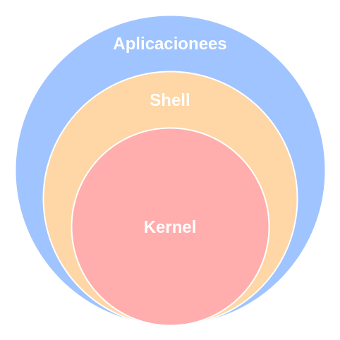

# Sistemas Linux

Los sistemas operativos Linux son sistemas operativos de tipo Unix, que suelen ser de código abierto, multiplataforma, multiusuario y multitarea. Estos sistemas operativos están formados por la combinación de varios proyectos, dentro de los cuales destacan el entorno **GNU**, así como el núcleo del sistema o kernel **Linux**, de ahí la denominación técnica **GNU/Linux** que hace referencia a los dos componentes principales de este tipo de sistemas operativos, a pesar de que cotidianamente se les llame solo sistemas Linux estos sistemas también están formados en una enorme parte por componentes del proyecto GNU, sin embargo, por simple facilidad se les seguirá llamando sistemas Linux en el resto del documento.

<p align="center">

</p>

Los tres componentes principales de todos los sistemas Linux son:

- **Kernel:** El kernel es el núcleo de cualquier sistema operativo, en el caso de los sistemas Linux el nombre del kernel es Linux, el kernel es el componente del sistema que gestiona todos los recursos de hardware, el acceso seguro a estos y los periféricos conectados al computador.
- **Shell:** El Shell en cualquier sistema basado en Unix, como los sistemas Linux, es el intérprete de comandos del sistema operativo, de forma resumida el Shell es un programa que permite al usuario ejecutar comandos, mediante los cuales se pueden dar instrucciones de forma directa al kernel del sistema operativo, el Shell además permite que los comandos de aplicaciones que trabajan con lenguajes de alto nivel sean procesados y ejecutados en un lenguaje de bajo nivel, permitiendo así que estas aplicaciones interactúen con el kernel.
- **Aplicaciones:** Las aplicaciones son los programas con los que se interactúa para realizar alguna actividad en concreto, en los sistemas Linux toda aplicación por debajo estas ejecutan acciones directamente en el kernel.

En los sistemas Linux existen varios tipos de shell de las cuales el usuario puede decidir cual usar, algunos de estos son:

1. **CSH:** En una shell diseñada para que los usuarios puedan escribir programas de scripting de shell con una sintaxis muy similar a la de C. En muchos sistemas como Red Hat, csh es tcsh, una versión mejorada de csh.
1. **SH:** También conocida como Shell Bourne, fue la primera shell creada para un sistema operativo Linux, se puede utilizar actualmente, pero no tiene funcionalidades como autocompletar archivos o guardar un historial de comandos.
1. **BASH:** También conocida como Shell Bourne-Again, es una versión actualizada de SH creada por la Free Software Foundation, es una de las shell más utilizadas y conocidas en el mundo, sin mencionar que es la shell por defecto que usan muchos de los sistemas Linux. Bash Incorpora alguna de las funcionalidades más avanzadas de KSH, CSH, SH y TCSH. Una de la funcionalidades más destacables de esta shell es la opción de ejecutar múltiples programas en segundo plano a la vez.
1. **ZSH:** Es una de las shell más potentes actualmente, puede funcionar como shell interactiva y como intérprete de lenguaje de scripting. aún siendo compatible con Bash.

<br><br>

## Comandos Bash

<br><br>

## Scripts Bash

Crear programas en Bash permite ejecutar múltiples comandos de forma secuencial para automatizar tareas específicas. Los comandos de un script Bash son colocados en un archivo de textos de manera secuencial para poder ejecutarlos a posterioridad.

<br>

### Crear un script Bash

Los scripts Bash al igual que cualquier otro tipo de script se crean como archivos de texto plano, sin embargo, al crear un script Bash este debe cumplir dos condiciones, el archivo en el que se guarda el script debe tener la extensión **.sh** y el nombre del script debe ser único para evitar conflictos entre el script nuevo y alguno otro que ya esté presente en el sistema, para garantizar que el nombre del archivo sea único se puede usar el comando **type** como se muestra a continuación, suponiendo que el nombre del script será **script**.

```bash
type script.sh
```

Usando el parámetro -a se pueden ver todos los archivos encontrados.

```bash
type -a script.sh
```

Usando el parámetro -t se puede verificar el tipo de archivo.

```bash
type -t script.sh
```

<br>

### Dar permisos de ejecución a un script Bash

Luego de crear el script es necesario darle al script permisos de ejecución, ya que de otra forma el script no podrá ejecutarse, hay varias formas de dar permisos de ejecución a un script, algunas de estas se listan a continuación.

```bash
# !/bin/bash
```

<br>

### Establecer Bash como intérprete de comandos del script

Antes de empezar a escribir un script Bash en cualquier sistema Linux es necesario indicar que el intérprete del script o shell será Bash, la forma correcta de indicar que el intérprete del script será Bash es agregando la ruta hacia Bash en la primera línea del script, como se muestra a continuación.

```bash
# !/bin/bash
```

<br>

### Declarar variables en scripts Bash

Las variables que puede usar un script Bash pueden ser de dos tipos, **variables de usuario** y **variables de entorno**. Las variables de usuario son variables que son accesibles sólo dentro de un programa específico, mientras que las de entorno son variables que son accesibles en todo el sistema, por todos los usuarios del sistema. En ambos casos las variables se definen iniciando con el nombre de la variable y no hace falta definir el tipo de dato de la variable, con la diferencia de que las variables de usuario por lo general se definen con todas las letras del nombre de la variable en minúsculas mientras que las de entorno se definen por lo general con todas las letras del nombre en mayúsculas.\
Para declarar que una variable dentro de un script será una variable de entorno hace falta, además, de definir la variable y su valor usar el comando **export**, con esta instrucción la variable pasa de ser de usuario a ser de entorno, por lo que inmediatamente después del comando **export** la variable ya es accesible por todo el sistema y por todos los usuarios del sistema.

Declaración de una variable de usuario en un script Bash.

```bash
variable_de_usuario="Hola Mundo"
```

Declaración de una variable de entorno en un script Bash.

```bash
VARIABLE_DE_ENTORNO="Hola Mundo"
export VARIABLE_DE_ENTORNO
```

<br>

### Recuperar variables en scripts Bash

Tras definir cualquier variable de usuario o de entorno lo normal es querer recuperar ese valor posteriormente ya que por lo general se usa para afectar la ejecución del script, en ambos casos para recuperar el valor de una variable se usa el signo "$" antes del nombre de la variable que se quiere recuperar, las variables de usuario solo serán accesibles dentro del script en el que se declararon, mientras que las variables de entorno que fueron definidas con el comando **export** serán accesibles también por otros scripts o mediante la terminal independientemente del usuario del sistema.

Recuperación de una variable de usuario.

```bash
echo $variable_de_usuario
Hola Mundo
```

Recuperación de una variable de entorno.

```bash
echo $VARIABLE_DE_ENTORNO
Hola Mundo
```

<br>

### Operadores aritméticos en scripts Bash

Asumiendo que se definen dos variables numA y numB las operaciones aritméticas básicas en Bash se definen de la siguiente forma.

```bash
numA=4
numB=10
```

Suma.

```bash
resultado=$((numA+numB))
```

Resta.

```bash
resultado=$((numA-numB))
```

Multiplicación.

```bash
resultado=$((numA*numB))
```

División.

```bash
resultado=$((numA/numB))
```

Residuo.

```bash
resultado=$((numA%numB))
```

<br>

### Operadores relacionales en scripts Bash

Asumiendo que se definen dos variables numA y numB las operaciones relacionales básicas en Bash se definen de la siguiente forma.

```bash
numA=4
numB=10
```

Operador mayor.

```bash
resultado=$((numA>numB))
resultado=$((numA -gt numB))
```

Operador menor.

```bash
resultado=$((numA<numB))
resultado=$((numA -lt numB))
```

Operador mayor o igual.

```bash
resultado=$((numA>=numB))
resultado=$((numA -ge numB))
```

Operador menor o igual.

```bash
resultado=$((numA<=numB))
resultado=$((numA -le numB))
```

Operador igual.

```bash
resultado=$((numA==numB))
resultado=$((numA -eq numB))
```

Operador diferente.

```bash
resultado=$((numA!=numB))
resultado=$((numA -ne numB))
```

<br>

### Operadores de asignación en scripts Bash

Asumiendo que se definen dos variables numA y numB las operaciones de asignación básicas en Bash se definen de la siguiente forma.

```bash
numA=4
numB=10
```

Sumar a numA numB.

```bash
resultado=$((numA+=numB))
```

Restar a numA numB.

```bash
resultado=$((numA-=numB))
```

Multiplicar a numA por numB.

```bash
resultado=$((numA*=numB))
```

Dividir a numA entre numB.

```bash
resultado=$((numA/=numB))
```

Residuo de numA entre numB.

```bash
resultado=$((numA%=numB))
```

<br>

### Ejecutar un script Bash

Las dos formas de ejecutar un Script Bash en Linux son:

```bash
bash script.sh
```

```bash
./script.sh
```

<br>

### Manejo de argumentos en scripts Bash

Los argumentos que son enviados a un script Bash se almacenan en una lista, donde cada argumento puede ser referenciado mediante su posición, para enviar argumentos basta con escribir cada argumento luego de la instrucción de ejecución del script con un espacio, cuando se quieren enviar cadenas como parámetros es necesario enviar la cadena entre comillas ya que si la cadena tiene espacios y no es enviada entre comillas será interpretada por el script como varios parámetros.

```bash
bash script.sh "primer argumento" 2
```

```bash
./script.sh "primer argumento" 2
```

Para acceder a un argumento de la lista de argumentos se debe usar el signo **$** y el número del argumento, el cual debe ser mayor a cero y menor a diez, si el número del argumento es de un solo dígito (0<n<10) no hace falta usar llaves, si el número del argumento es de más de un dígito (n>=10) es necesario usar llaves antes de indicar el número del argumento.

```bash
$1
```

```bash
${10}
```

Además de poder acceder por número de argumento se pueden usar ciertas instrucciones para obtener más información respecto a los parámetros recibidos por el script.

Obtener el nombre del script.

```bash
$0
```

Obtener el conteo de los argumentos.

```bash
$#
```

Obtener todos los argumentos

```bash
$*
```

<br>

### Manejo de opciones en scripts Bash

Las opciones en los scripts Bash se usan para modificar el funcionamiento del script, por lo que son sumamente importantes. Usualmente las opciones son antecedidas por un **-** o un **--**. Para validar opciones en scripts Bash es necesario que los scripts internamente iteren sobre el listado de todos los argumentos que reciben en busca de las opciones definidas.

```bash

for var in "$*"; do
    case "$var" in
    --all) echo "opción --all";;
    -a) echo "opción -a";;
    -b) echo "opción -b";;
    -c) echo "opción -c";;
    *) echo "opcion no encontrada";;
    esac
    shift
done

```

<br>

### Sustitución de comandos en variables en scripts Bash

La sustitución de comandos en variables permite ejecutar un comando y almacenar el resultado en una variable.

Las dos formas de sustituir comandos en variables son:

```bash
ubicacionActual=`pwd`
```

```bash
ubicacionActual=$(pwd)
```

<br>

### Depuración en scripts Bash

La depuración es el proceso de identificar y corregir errores de programación. Bash provee ciertos comandos que permiten ejecutar un script al tiempo que emite los resultados del mismo en la línea de comandos.

Las dos formas de hacer depuración en Bash son:

```bash
bash -v script.sh
```

```bash
bash -x script.sh
```

<br>

### Capturar información del usuario en scripts Bash

La captura de información del usuario es un proceso fundamental para desarrollar programas Bash interactivos, es decir, programas que cambian su ejecución o sus procesos en función de cierta información que es suministrada al programa por el usuario durante su ejecución, para capturar información del usuario en un script Bash se usa el comando **read**, las entradas capturadas por read se almacenen en la variable **REPLY** a no ser que se modifique el comportamiento de red con el parámetro **-p** el cual emite una frase para pedir la entrada además de guardarla en una variable específica.

Las dos formas de hacer solicitar y capturar entradas en Bash son:

```bash
echo -n "Ingrese el valor 1:"
read
valor_1=$REPLY
echo -n "Ingrese el valor 2:"
read
valor_2=$REPLY
```

```bash
read -p "Ingrese el valor 1:" valor_1
read -p "Ingrese el valor 2:" valor_1
```

Algunos de los parámetros más utilizados junto a read son:

- **-p:** Permite ingresar una frase o prompt antes de pedir una entrada.
- **-s:** Modo Sigiloso. No muestra ningún carácter en la terminal, útil para contraseñas o información sensible.
- **-n [número de caracteres]:** Permite leer como máximo cierto número de caracteres.
- **-r:** Toma el botón de retroceso o backspace como un carácter y no borra ningún otro carácter previamente escrito.

Para validar que los datos ingresados por el usuario sean datos de cierto tipo en Bash es necesario hacer una comprobación de datos usando expresiones regulares, además, para comparar la entrada con la expresión regular se debe utilizar el siguiente formato especial **if [[$variable =~ $expresionRegular]]**.

```bash

id_regex='^[0-9]{10}$'
read -p "ID: " u_id

if [[ $u_id =~ $id_regex ]]; then
    echo -e "Id válida"
else
    echo -e "Id no válida"
fi

```

<br>

### Condicionales if/else en scripts Bash

Los condicionales en los scripts Bash tienen la particularidad de que al usar **if** o **elif** siempre la sentencia del condicional debe ir entre corchetes y además debe haber un espacio entre los corchetes y la sentencia del condicional al iniciar y finalizar la sentencia.

```bash

if [ condicion_1 ]; then
    echo -e "Se cumplio condicion_1"
elif [ condicion_2 ]; then
    echo -e "Se cumplio condicion_2"
elif [ condicion_3 ] && [ condicion_4 ]; then
    echo -e "Se cumplieron condicion_3 y condicion_4"
else
    echo -e "No se cumplieron ni condicion_1 ni condicion_2"
fi

```

Al anidar condicionales en Bash la estructura general es la siguiente.

```bash

if [ condicion_1 ]; then
    if [ condicion_2 ]; then
        echo -e "Se cumplieron condicion_1 y condicion_2"
    elif [ condicion_3 ]; then
        echo -e "Se cumplieron condicion_1 y condicion_3"
    else
    echo -e "Se cumplio condicion_1"
    fi
else
    echo -e "No se cumplio condicion_1"
fi

```

**Nota:** Cuando se comparan dos números se utiliza el operador relacional **==**, cuando se comparan cadenas se utiliza **=**.

<br>

### Sentencia case en scripts Bash

Las sentencias case en Bash son muy similares a la sentencia switch de otros lenguajes de programación, permite evaluar varios casos para un valor simple o un rango de valores.

```bash
case "$var" in
"A") echo "opción A";;
"B") echo "opción B";;
"C") echo "opción C";;
"D") echo "opción D";;
{E-G}) echo "la opción aún no está implementada"
*) echo "opcion no encontrada";;
esac
```

<br>

### Declarar arreglos en scripts Bash

En Bash los arreglos pueden contener una cantidad de valores finita independientemente de su tipo de dato, además, los arreglos en Bash son dinámicos, es decir que incluso luego de establecer ciertos datos dentro del arreglo este puede seguir aumentando o disminuyendo sin ningún inconveniente.

Declarar valores de un arreglo.

```bash
arreglo_numeros=(1 2 3 4 5 6 7 8)
arreglo_cadenas=(perro, gato)
arreglo_rangos=({A…Z} {10…20})
```

Imprimir valores de un arreglo.

```bash
echo -e "arreglo de numeros: ${arreglo_numeros[*]}"
echo -e "arreglo de cadenas: ${arreglo_cadenas[*]}"
echo -e "arreglo mixto generado con rangos: ${arreglo_rangos[*]}"
```

Imprimir tamaño de un arreglo.

```bash
echo -e "tamaño del arreglo de numeros: ${#arreglo_numeros[*]}"
echo -e "tamaño del arreglo de cadenas: ${#arreglo_cadenas[*]}"
echo -e "tamaño del arreglo mixto generado con rangos: ${#arreglo_rangos[*]}"
```

Imprimir indices de un arreglo.

```bash
echo -e "posicion 0  del arreglo de numeros: ${arreglo_numeros[0]}"
echo -e "posicion 1  del arreglo de cadenas: ${arreglo_cadenas[1]}"
echo -e "posicion 2  del arreglo mixto generado con rangos: ${arreglo_rangos[2]}"
```

Agregar valores a un arreglo.

```bash
arreglo_numeros[0]=9
arreglo_cadenas[0]=cabra
arreglo_rangos[0]=11
```

Eliminar valores de un arreglo.

```bash
unset arreglo_numeros[0]
unset arreglo_cadenas[0]
unset arreglo_rangos[0]
```

<br>
